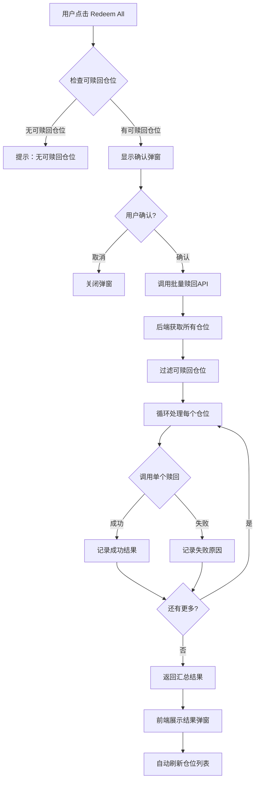
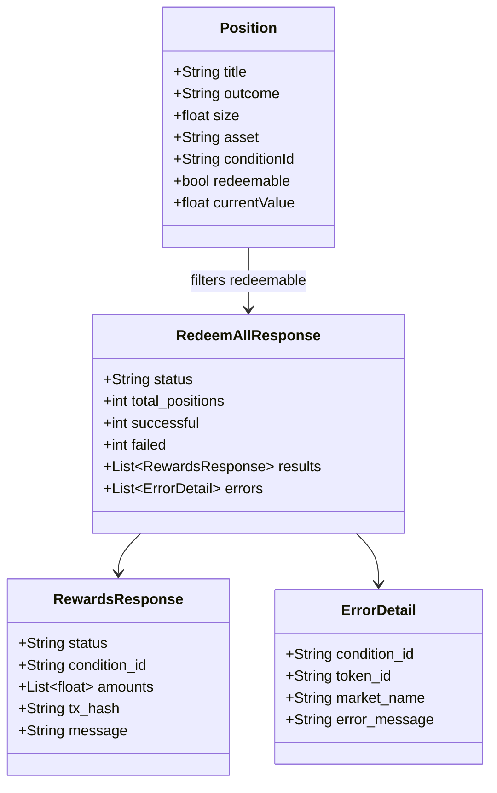
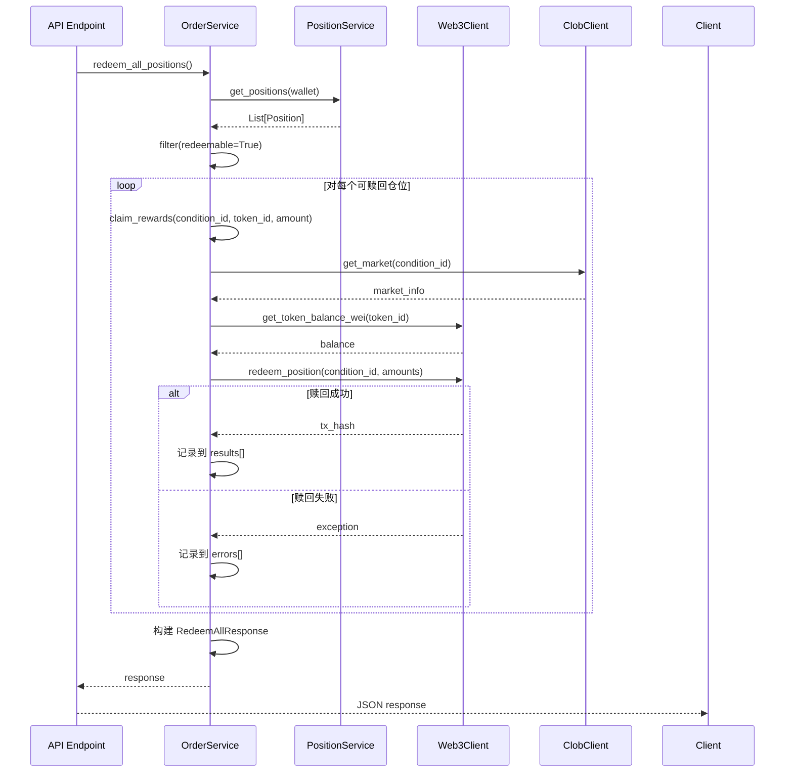
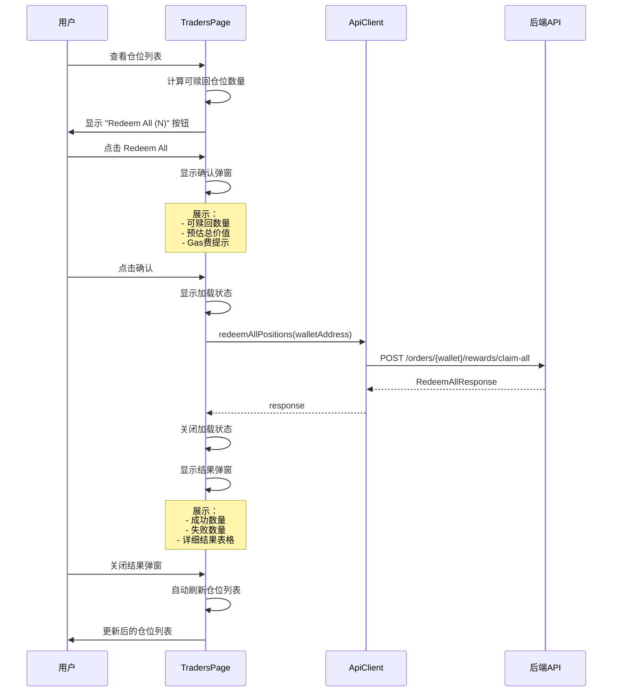

# 批量赎回所有可赎回仓位功能设计文档

## 1. 背景
### 1.1 功能介绍
本功能旨在为用户提供一键批量赎回所有已解决市场中可赎回仓位的能力。当前系统仅支持单个仓位的赎回操作，用户需要逐个点击每个可赎回仓位的"Redeem"按钮，操作繁琐且耗时。

批量赎回功能将允许用户通过点击一个"Redeem All"按钮，自动赎回钱包中所有符合条件的可赎回仓位，显著提升用户体验和操作效率。

### 1.2 需求与痛点
**当前痛点：**
- 用户持有多个已解决市场的仓位时，需要逐个手动赎回，操作重复且低效
- 无法快速查看总共有多少可赎回仓位
- 每次赎回都需要单独确认和等待交易完成
- 用户可能遗漏某些可赎回的仓位，导致资金闲置

**业务需求：**
- 提供批量赎回功能，一次性处理所有可赎回仓位
- 显示清晰的操作结果反馈（成功/失败数量、详细信息）
- 在批量操作中确保单个失败不影响其他赎回
- 提供完整的错误处理和用户友好的提示

**性能目标：**
- 支持批量处理至少50个仓位
- 单个仓位赎回失败不阻塞整体流程
- 提供实时进度反馈

### 1.3 使用场景
**场景1：交易员日常结算**
> 交易员Alice持有15个已解决市场的仓位，每天需要赎回收益。使用批量赎回功能，她只需点击一次"Redeem All"按钮，即可在几分钟内完成所有赎回操作，而不是逐个点击15次。

**场景2：大规模投资组合清算**
> 投资机构Bob管理着包含50+个市场的投资组合，当多个市场同时解决时，批量赎回功能可以帮助他快速回收资金，避免手动操作带来的时间成本和人为错误。

**场景3：错误恢复处理**
> 用户Carol在批量赎回过程中遇到部分交易失败（如gas不足），系统会详细显示哪些仓位赎回成功，哪些失败，方便她针对性地重试失败的赎回操作。

## 2. 整体设计
本功能采用前后端分离架构，在现有赎回逻辑基础上增加批量处理能力：

1. **后端新增批量赎回服务方法**：在 `OrderService` 中添加 `redeem_all_positions()` 方法
2. **新增API端点**：提供 `POST /orders/{wallet_address}/rewards/claim-all` 接口
3. **前端UI增强**：在 Traders 页面添加"Redeem All"按钮及相关交互
4. **结果展示优化**：提供详细的批量操作结果反馈



### 2.1 模块划分
* **Frontend - TradersPage 组件**：负责UI交互、按钮显示、确认弹窗、结果展示
* **Frontend - ApiClient**：负责与后端API通信，新增 `redeemAllPositions()` 方法
* **Backend - OrderService**：负责核心业务逻辑，实现 `redeem_all_positions()` 批量处理方法
* **Backend - API Routes**：负责RESTful接口暴露，新增批量赎回端点
* **Backend - Schemas**：负责请求/响应数据验证，定义 `RedeemAllResponse` 模型

### 2.2 核心流程
1. 用户在 Traders 页面查看仓位列表
2. 系统根据仓位数据判断是否显示"Redeem All"按钮（需要至少1个可赎回仓位）
3. 用户点击按钮，前端显示确认弹窗（包含可赎回仓位数量、预估价值）
4. 用户确认后，前端调用批量赎回API
5. 后端获取钱包所有仓位，过滤出 `redeemable=true` 的仓位
6. 后端顺序调用现有的 `claim_rewards()` 方法处理每个仓位
7. 收集每个赎回操作的结果（成功/失败及详细信息）
8. 返回汇总结果给前端
9. 前端展示详细结果弹窗，并自动刷新仓位列表

## 3. 数据模型 / API 设计
### 3.1 数据结构



**后端数据结构（Pydantic Models）：**
```python
class RedeemAllResponse(BaseModel):
    """批量赎回响应模型"""
    status: str = Field(..., description="整体状态: success/partial/failed")
    total_positions: int = Field(..., description="可赎回仓位总数")
    successful: int = Field(..., description="成功赎回数量")
    failed: int = Field(..., description="失败赎回数量")
    results: List[RewardsResponse] = Field(default_factory=list, description="成功的赎回结果列表")
    errors: List[Dict[str, Any]] = Field(default_factory=list, description="失败的错误信息列表")

class ErrorDetail(TypedDict):
    """单个失败的详细信息"""
    condition_id: str
    token_id: str
    market_name: str
    error_message: str
```

**前端数据结构（TypeScript）：**
```typescript
interface RedeemAllResponse {
  status: string;
  total_positions: number;
  successful: number;
  failed: number;
  results: RewardsResponse[];
  errors: ErrorDetail[];
}

interface ErrorDetail {
  condition_id: string;
  token_id: string;
  market_name: string;
  error_message: string;
}
```

### 3.2 API 设计

**新增端点：**
```
POST /orders/{wallet_address}/rewards/claim-all
```

**请求参数：**
- Path Parameter: `wallet_address` (string) - 钱包地址
- Request Body: 无（使用钱包下所有可赎回仓位）

**响应示例：**
```json
{
  "status": "partial",
  "total_positions": 5,
  "successful": 4,
  "failed": 1,
  "results": [
    {
      "status": "success",
      "condition_id": "0x123...",
      "amounts": [100.5, 0],
      "tx_hash": "0xabc...",
      "message": "Rewards claimed successfully"
    }
  ],
  "errors": [
    {
      "condition_id": "0x456...",
      "token_id": "789",
      "market_name": "Market ABC",
      "error_message": "Insufficient balance"
    }
  ]
}
```

**状态码：**
- 200: 全部成功或部分成功
- 400: 无可赎回仓位
- 500: 系统错误

**前端 API Client 方法：**
```typescript
class ApiClient {
  async redeemAllPositions(walletAddress: string): Promise<RedeemAllResponse> {
    const response = await this.client.post(
      `/orders/${walletAddress}/rewards/claim-all`
    );
    return response.data;
  }
}
```

## 4. 详细设计

### 4.1 后端流程：批量赎回服务



**流程说明：**
1. API 端点接收请求，调用 `OrderService.redeem_all_positions()`
2. 通过 `PositionService` 获取钱包的所有仓位数据
3. 过滤出 `redeemable=True` 的仓位
4. 遍历每个可赎回仓位：
   - 提取 `condition_id`, `token_id`, `size`
   - 调用现有的 `claim_rewards()` 方法
   - 如果成功，将结果添加到 `results` 列表
   - 如果失败，捕获异常，将错误信息添加到 `errors` 列表
5. 构建响应对象，包含统计信息和详细结果
6. 返回给API层，转换为JSON响应

**关键设计点：**
- **顺序执行而非并发**：避免 nonce 冲突，保证交易顺序
- **失败不中断**：单个赎回失败不影响后续处理
- **详细日志**：记录每个操作的详细信息，便于调试
- **复用现有逻辑**：调用已验证的 `claim_rewards()` 方法，保证一致性

### 4.2 前端流程：UI 交互与反馈



**UI 组件设计：**

**1. Redeem All 按钮**
- 位置：Traders 页面顶部，与 "Refresh All" 按钮并列
- 显示条件：至少有1个可赎回仓位时显示
- 按钮文本：`Redeem All ({count})` - 动态显示可赎回数量
- 样式：primary 类型，带有钱币图标

**2. 确认弹窗（Modal）**
```typescript
interface ConfirmModalData {
  redeemableCount: number;      // 可赎回数量
  totalValue: number;            // 预估总价值
  positions: Position[];         // 可赎回仓位列表
}
```
- 标题：确认批量赎回
- 内容：
  - 显示可赎回仓位数量
  - 显示预估总价值（USDC）
  - 显示简化的仓位列表（市场名称、结果、价值）
  - 警告：提示可能产生的 Gas 费用
- 按钮：取消 / 确认赎回

**3. 结果弹窗（Modal）**
```typescript
interface ResultModalData {
  status: string;                // success/partial/failed
  successful: number;
  failed: number;
  results: Array<{
    market: string;
    outcome: string;
    amount: number;
    txHash: string;
  }>;
  errors: Array<{
    market: string;
    outcome: string;
    error: string;
  }>;
}
```
- 标题：批量赎回结果
- 内容：
  - 顶部统计卡片：成功数/失败数/总数
  - 成功列表（Table）：市场、结果、金额、交易哈希（可点击查看）
  - 失败列表（Table）：市场、结果、错误原因
  - 重试按钮（仅在有失败时显示）
- 按钮：关闭（自动触发刷新）

### 4.3 错误处理与边界情况

**错误类型与处理：**

| 错误类型 | 处理策略 | 用户提示 |
|---------|---------|---------|
| 无可赎回仓位 | 禁用按钮，不显示 | - |
| 单个仓位赎回失败 | 继续处理其他，记录错误 | 在结果中显示失败原因 |
| 网络超时 | 整体失败，返回500 | 请求超时，请稍后重试 |
| 余额不足（Gas） | 单个失败，继续处理 | 某个仓位 Gas 不足 |
| 钱包未授权 | 整体失败，返回403 | 钱包未授权操作 |
| 交易冲突（Nonce） | 顺序执行避免此问题 | - |

**边界情况处理：**

1. **大批量仓位（50+）**
   - 设置最大处理数量限制（如100）
   - 超过限制时分批处理或提示用户
   - 显示进度条（已处理/总数）

2. **部分仓位已不可赎回**
   - 在调用 API 前再次验证仓位状态
   - 仅处理确认可赎回的仓位

3. **并发操作冲突**
   - 前端按钮在处理期间禁用
   - 后端使用事务或锁机制保护

4. **中途网络中断**
   - 已成功的赎回不会回滚
   - 显示部分成功的结果
   - 允许用户重试失败的部分

## 5. 伪代码实现

### 5.1 后端核心逻辑：redeem_all_positions

```python
def redeem_all_positions(self) -> Dict[str, Any]:
    """
    批量赎回所有可赎回仓位

    Returns:
        Dict: 包含整体状态、成功/失败统计、详细结果
    """
    logger.info(f"开始批量赎回，钱包: {self.wallet.name}")

    # 初始化结果容器
    results = []
    errors = []

    try:
        # 1. 获取所有仓位（需要注入 PositionService）
        positions = self.position_service.get_positions(self.wallet)

        # 2. 过滤可赎回仓位
        redeemable_positions = [p for p in positions if p.redeemable]
        total_count = len(redeemable_positions)

        logger.info(f"找到 {total_count} 个可赎回仓位")

        if total_count == 0:
            return {
                "status": "success",
                "total_positions": 0,
                "successful": 0,
                "failed": 0,
                "results": [],
                "errors": []
            }

        # 3. 遍历处理每个仓位
        for index, position in enumerate(redeemable_positions):
            try:
                logger.info(
                    f"处理仓位 {index + 1}/{total_count}: "
                    f"{position.title} - {position.outcome}"
                )

                # 提取必要参数
                condition_id = position.conditionId
                token_id = position.asset
                amount = position.size

                # 参数验证
                if not all([condition_id, token_id, amount > 0]):
                    raise ValueError("缺少必要参数")

                # 调用单个赎回方法（复用现有逻辑）
                result = self.claim_rewards(
                    condition_id=condition_id,
                    token_id=token_id,
                    amount=amount
                )

                # 记录成功结果，添加市场信息
                result['market_name'] = position.title
                result['outcome'] = position.outcome
                results.append(result)

                logger.info(f"仓位 {position.title} 赎回成功")

            except Exception as e:
                # 记录失败信息，不中断循环
                error_detail = {
                    "condition_id": getattr(position, 'conditionId', 'unknown'),
                    "token_id": getattr(position, 'asset', 'unknown'),
                    "market_name": getattr(position, 'title', 'unknown'),
                    "outcome": getattr(position, 'outcome', 'unknown'),
                    "error_message": str(e)
                }
                errors.append(error_detail)

                logger.error(
                    f"仓位 {position.title} 赎回失败: {e}",
                    exc_info=True
                )

        # 4. 构建响应
        successful = len(results)
        failed = len(errors)

        # 确定整体状态
        if failed == 0:
            status = "success"
        elif successful == 0:
            status = "failed"
        else:
            status = "partial"

        response = {
            "status": status,
            "total_positions": total_count,
            "successful": successful,
            "failed": failed,
            "results": results,
            "errors": errors
        }

        logger.info(
            f"批量赎回完成: 成功 {successful}, 失败 {failed}, 总数 {total_count}"
        )

        return response

    except Exception as e:
        logger.error(f"批量赎回失败: {e}", exc_info=True)
        raise
```

### 5.2 前端核心逻辑：handleRedeemAll

```typescript
const handleRedeemAll = async () => {
  try {
    // 1. 计算可赎回仓位
    const redeemablePositions = positionData?.positions.filter(
      p => p.redeemable === true
    ) || [];

    if (redeemablePositions.length === 0) {
      message.warning('没有可赎回的仓位');
      return;
    }

    // 2. 计算预估总价值
    const totalValue = redeemablePositions.reduce(
      (sum, p) => sum + (p.currentValue || 0),
      0
    );

    // 3. 显示确认弹窗
    const confirmed = await showConfirmModal({
      title: '确认批量赎回',
      content: (
        <>
          <p>将赎回 <b>{redeemablePositions.length}</b> 个仓位</p>
          <p>预估总价值: <b>${totalValue.toFixed(2)}</b> USDC</p>
          <p style={{ color: '#ff9800' }}>
            ⚠️ 此操作会产生 Gas 费用，请确保钱包余额充足
          </p>
        </>
      )
    });

    if (!confirmed) return;

    // 4. 显示加载状态
    setRedeemAllLoading(true);
    message.loading({ content: '批量赎回进行中...', key: 'redeem-all' });

    // 5. 调用 API
    const result = await apiClient.redeemAllPositions(selectedWallet);

    // 6. 关闭加载状态
    setRedeemAllLoading(false);
    message.destroy('redeem-all');

    // 7. 显示结果
    showResultModal({
      status: result.status,
      successful: result.successful,
      failed: result.failed,
      results: result.results.map(r => ({
        market: r.market_name || 'Unknown',
        outcome: r.outcome || 'Unknown',
        amount: r.amounts?.reduce((a, b) => a + b, 0) || 0,
        txHash: r.tx_hash
      })),
      errors: result.errors.map(e => ({
        market: e.market_name,
        outcome: e.outcome,
        error: e.error_message
      }))
    });

    // 8. 成功提示
    if (result.status === 'success') {
      message.success(`成功赎回 ${result.successful} 个仓位`);
    } else if (result.status === 'partial') {
      message.warning(
        `部分成功: 成功 ${result.successful}, 失败 ${result.failed}`
      );
    } else {
      message.error(`批量赎回失败`);
    }

    // 9. 自动刷新仓位列表
    await loadWalletData(selectedWallet);

  } catch (error) {
    setRedeemAllLoading(false);
    message.destroy('redeem-all');

    const err = error as { response?: { data?: { detail?: string } } };
    message.error(
      `批量赎回失败: ${err.response?.data?.detail || '未知错误'}`
    );

    console.error('Redeem all error:', error);
  }
};
```

### 5.3 依赖注入：OrderService 集成 PositionService

```python
# poly_boost/services/order_service.py

class OrderService:
    def __init__(
        self,
        wallet: Wallet,
        clob_client: PolymarketClobClient,
        web3_client: PolymarketWeb3Client,
        position_service: Optional['PositionService'] = None  # 新增依赖
    ):
        self.wallet = wallet
        self.clob_client = clob_client
        self.web3_client = web3_client
        self.position_service = position_service  # 用于获取仓位列表
```

**依赖工厂修改（poly_boost/api/dependencies.py）：**
```python
def get_order_service(wallet_address: str) -> OrderService:
    wallet = wallet_manager.get_or_raise(wallet_address)
    client_factory = get_client_factory()
    clob_client = client_factory.create_clob_client(wallet)
    web3_client = client_factory.create_web3_client(wallet)

    # 创建 PositionService（用于批量赎回）
    data_client = client_factory.create_data_client()
    position_service = PositionService(
        clob_client=clob_client,
        data_client=data_client,
        wallet_manager=wallet_manager
    )

    return OrderService(
        wallet=wallet,
        clob_client=clob_client,
        web3_client=web3_client,
        position_service=position_service  # 注入依赖
    )
```

## 6. 测试策略

### 6.1 单元测试

**后端测试（pytest）：**
```python
def test_redeem_all_positions_success():
    """测试批量赎回全部成功"""
    # Mock 3个可赎回仓位
    # 验证返回结果：successful=3, failed=0, status='success'
    pass

def test_redeem_all_positions_partial():
    """测试批量赎回部分成功"""
    # Mock 5个仓位，其中2个失败
    # 验证返回结果：successful=3, failed=2, status='partial'
    pass

def test_redeem_all_positions_no_redeemable():
    """测试无可赎回仓位"""
    # Mock 0个可赎回仓位
    # 验证返回结果：total_positions=0
    pass

def test_redeem_all_positions_error_handling():
    """测试异常处理"""
    # Mock claim_rewards 抛出异常
    # 验证错误被正确捕获并记录到 errors 列表
    pass
```

**前端测试（Jest + React Testing Library）：**
```typescript
test('Redeem All button is visible when redeemable positions exist', () => {
  // 渲染组件，传入包含可赎回仓位的数据
  // 验证 "Redeem All" 按钮存在
});

test('Redeem All button shows correct count', () => {
  // 渲染组件，3个可赎回仓位
  // 验证按钮文本为 "Redeem All (3)"
});

test('Confirmation modal displays correct information', async () => {
  // 点击 Redeem All
  // 验证确认弹窗显示正确的数量和价值
});

test('Result modal shows success and failure details', async () => {
  // Mock API 返回部分成功结果
  // 验证结果弹窗正确展示成功和失败列表
});
```

### 6.2 集成测试

**端到端测试场景：**
1. 用户登录 → 选择钱包 → 点击 Redeem All → 确认 → 查看结果 → 验证仓位列表更新
2. 大批量测试：50个可赎回仓位，验证处理时间和结果准确性
3. 网络故障模拟：中途断网，验证部分成功结果正确返回
4. 并发测试：同时赎回和刷新，验证状态一致性

### 6.3 性能测试

**测试指标：**
- 10个仓位批量赎回：< 1分钟
- 50个仓位批量赎回：< 5分钟
- 单个仓位失败不增加总时间 > 10%
- API 响应超时设置：300秒（5分钟）

## 7. 上线计划

### 7.1 开发阶段
1. **Phase 1 - 后端开发**（1-2天）
   - 实现 `redeem_all_positions()` 方法
   - 新增 Pydantic Schema
   - 添加 API 端点
   - 修改依赖注入

2. **Phase 2 - 前端开发**（1-2天）
   - 添加 API Client 方法
   - 实现 Redeem All 按钮和确认弹窗
   - 实现结果展示弹窗
   - UI/UX 优化

3. **Phase 3 - 测试**（1天）
   - 单元测试
   - 集成测试
   - 手动测试多种场景

### 7.2 部署与监控
**部署前检查：**
- [ ] 所有测试通过
- [ ] 代码审查完成
- [ ] API 文档更新
- [ ] 错误日志配置完善

**监控指标：**
- 批量赎回成功率
- 平均处理时间
- 单个仓位失败率
- 用户使用频率

**回滚计划：**
- 如发现严重问题，可通过功能开关快速禁用批量赎回按钮
- 保留单个赎回功能不受影响

## 8. 附录

### 8.1 相关文件清单
**需要修改的文件：**
- `poly_boost/services/order_service.py` - 新增批量赎回方法
- `poly_boost/api/routes/orders.py` - 新增 API 端点
- `poly_boost/api/schemas/order_schemas.py` - 新增响应模型
- `poly_boost/api/dependencies.py` - 修改依赖注入
- `frontend/src/pages/Traders/index.tsx` - 添加 UI 组件
- `frontend/src/api/client.ts` - 新增 API 调用方法
- `frontend/src/types.ts` - 新增类型定义（如需要）

**需要创建的测试文件：**
- `tests/services/test_order_service_redeem_all.py`
- `frontend/src/pages/Traders/__tests__/RedeemAll.test.tsx`

### 8.2 风险评估
| 风险 | 影响 | 概率 | 缓解措施 |
|------|------|------|---------|
| 大批量导致超时 | 高 | 中 | 设置合理超时、分批处理提示 |
| 单个失败影响全局 | 中 | 低 | 独立错误处理、不中断流程 |
| Gas 费用过高 | 低 | 中 | 确认弹窗提示、用户自主决策 |
| 并发操作冲突 | 中 | 低 | 按钮禁用、后端锁机制 |

### 8.3 未来优化方向
1. **进度条显示**：实时显示当前处理进度（已处理N/总数M）
2. **Gas 预估**：在确认弹窗中显示预估 Gas 费用
3. **选择性赎回**：允许用户勾选部分仓位进行批量赎回
4. **异步处理**：大批量任务改为后台异步处理，轮询结果
5. **智能重试**：对失败的赎回自动重试（配置重试次数）
6. **导出报告**：支持将批量赎回结果导出为 CSV 或 PDF

---

**文档版本：** v1.0
**创建日期：** 2025-12-07
**作者：** Claude Code Assistant
**状态：** 待评审
