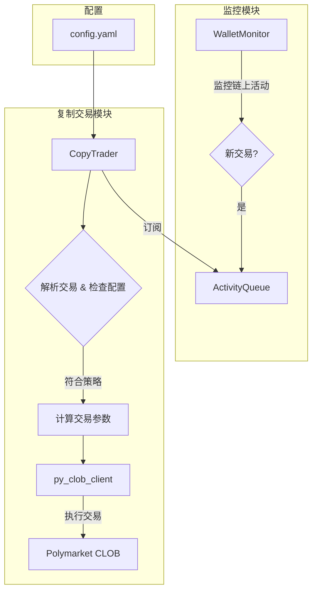
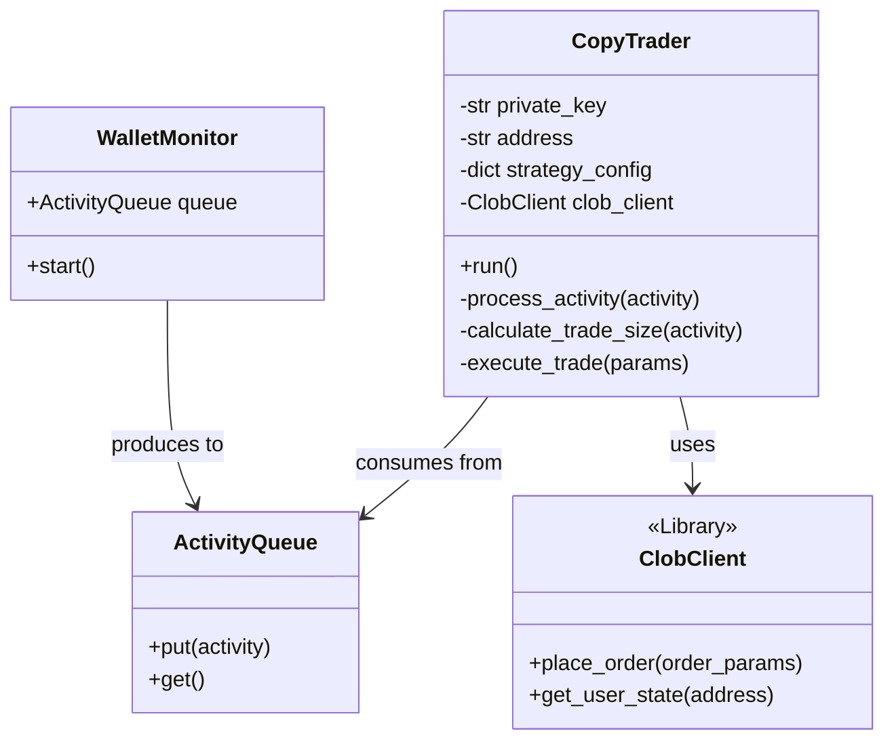
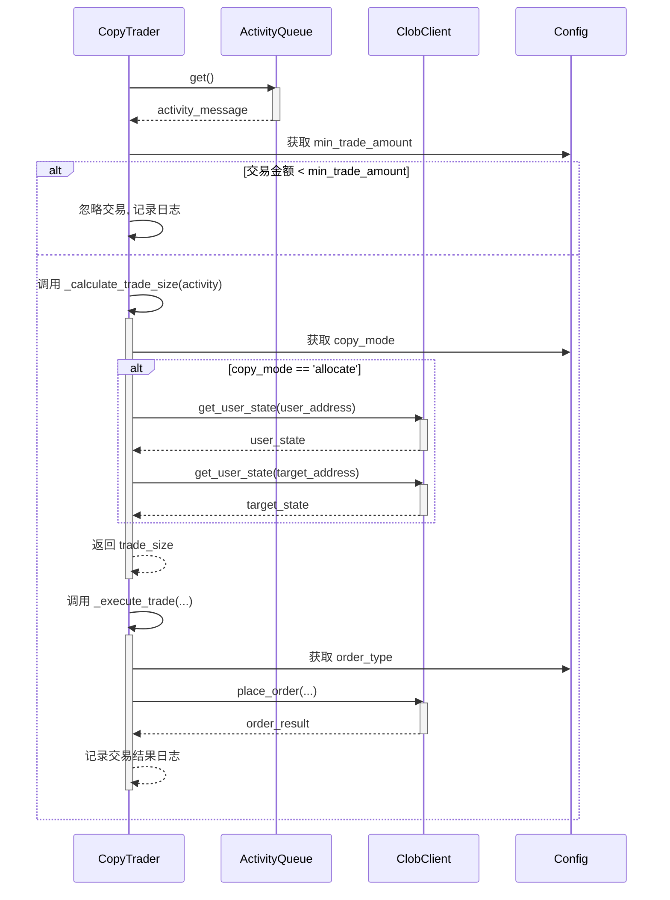

# 复制交易功能 设计文档

## 1. 背景

### 1.1 功能简介

本项目旨在为现有的钱包监控系统增加自动化的复制交易（Copy Trading）功能。用户将能够配置自己的钱包，以自动复制一个或多个“目标钱包”在 Polymarket 上的交易活动。该功能会监听目标钱包的交易，并根据用户设定的策略（如按比例缩放或按比例分配）在自己的钱包中执行类似交易。

### 1.2 需求与痛点

*   **痛点**: 当前系统仅实现了对目标钱包活动的监控和提醒，用户在收到提醒后需要手动登录并执行交易，这个过程存在延迟，可能导致错失最佳交易时机，也无法实现自动化。
*   **需求**: 实现一个全自动的交易执行流程，减少手动干预，确保能够及时跟随目标钱包的策略。
*   **需求**: 提供灵活的资金管理策略，允许用户根据自身的资金规模和风险偏好来调整复制交易的金额，而不是简单地1:1复制。
*   **需求**: 增加风险控制机制，如最小触发金额，避免跟随高频但价值过低的交易，降低交易成本和风险。
*   **需求**: 提供不同的订单执行方式（市价单/限价单），以应对不同的市场流动性和滑点预期。

### 1.3 使用场景

*   **场景一**: 用户小A发现了一个交易高手B，希望跟随B的策略。小A将B的钱包地址设为目标钱包，配置好自己的私钥，并选择“按比例缩放”模式，设置交易金额为B的10%。当B在某个市场下注100 USDC时，系统会自动在小A的钱包中下注10 USDC。
*   **场景二**: 用户小C希望用自己总资产的固定比例来跟随高手D。小C选择“按比例分配”模式。当D用其总余额的5%进行一笔交易时，系统会自动计算小C钱包总余额的5%，并用这部分资金进行跟单。

## 2. 概要设计

此功能的核心是创建一个 `CopyTrader` 类，它作为现有 `ActivityQueue` 的消费者。`WalletMonitor` 负责监控目标钱包并向队列中生产交易活动消息。`CopyTrader` 订阅这些消息，解析后根据配置文件中的策略，使用 `py-clob-client` 库执行实际的交易下单操作。



### 2.1 模块划分

*   **`ConfigLoader`** (修改): 扩展现有模块，增加对用户钱包私钥、地址、复制策略（模式、比例、最小金额、订单类型、限价单持续时间）等新配置项的解析和验证。
*   **`CopyTrader`** (新增): 核心逻辑模块，负责：
    *   从 `ActivityQueue` 消费交易活动。
    *   根据配置的策略（如最小触发金额）过滤交易。
    *   根据配置的模式（按比例缩放/按比例分配）计算下单金额。
    *   调用 `py-clob-client` 执行下单（市价/限价）。
*   **`main.py`** (修改): 在程序启动时，初始化并运行 `CopyTrader` 实例，将其与 `ActivityQueue` 连接。
*   **`py_clob_client`** (依赖): 作为交易执行的客户端，与 Polymarket 的订单簿进行交互。

### 2.2 核心流程

1.  `WalletMonitor` 检测到目标钱包有新的交易活动，并将活动详情（如交易对、方向、金额、价格）封装成消息放入 `ActivityQueue`。
2.  `CopyTrader` 实例从队列中获取该消息。
3.  `CopyTrader` 检查该笔交易的价值是否超过 `config.yaml` 中设置的 `min_trade_amount`。
4.  若超过，则根据 `copy_mode`（`scale` 或 `allocate`）计算用户需要下单的金额。
    *   **Scale Mode**: `user_trade_value = target_trade_value * scale_percentage`。
    *   **Allocate Mode**: `user_trade_value = user_wallet_balance * (target_trade_value / target_wallet_balance)`。
5.  根据 `order_type`（`market` 或 `limit`）准备下单参数。
    *   **Market Order**: 直接使用计算出的金额下单。
    *   **Limit Order**: 使用目标钱包的成交价作为限价，并设置订单的有效时间。
6.  调用 `py_clob_client.place_order()` 方法，将交易请求发送至 Polymarket。
7.  记录交易日志，包括成功或失败的状态。

## 3. 数据模型/API设计

### 3.1 数据结构

#### 3.1.1 配置文件 (config.yaml)

需要新增 `user_wallets` 配置节，支持配置一个或多个用户钱包，每个钱包可以有独立的复制策略。

```yaml
# config.yaml

rpc_url: "YOUR_RPC_URL"
target_wallets:
  - "0x..."

# 新增部分
user_wallets:
  - name: "MyMainWallet" # 钱包别名
    address: "0x..."
    private_key: "YOUR_PRIVATE_KEY" # 注意：建议使用更安全的方式管理私钥，如环境变量
    copy_strategy:
      min_trade_amount: 10 # 最小触发金额 (USDC)，默认为0
      order_type: "limit" # 订单类型: "market" 或 "limit", 默认 "market"
      limit_order_duration: 7200 # 限价单持续时间（秒），默认 2小时 (7200s)
      copy_mode: "scale" # 复制模式: "scale" 或 "allocate"
      
      # scale 模式专用配置
      scale_percentage: 1.0 # 按比例缩放的百分比 (1.0 = 1%)
      
      # allocate 模式在执行时动态计算，无需额外配置

```

#### 3.1.2 核心类图



### 3.2 API 设计

#### 3.2.1 `CopyTrader` 内部核心方法

```python
class CopyTrader:
    def __init__(self, wallet_config: dict, activity_queue: ActivityQueue):
        # ... 初始化 ...

    def run(self):
        """启动消费者循环，持续处理队列中的交易活动"""
        pass

    def _process_activity(self, activity: dict):
        """处理单个交易活动消息的完整流程"""
        pass

    def _calculate_trade_size(self, activity: dict) -> float:
        """
        根据配置的 copy_mode 计算最终的交易金额 (USDC)
        - 如果是 'scale' 模式, 返回 target_trade_value * scale_percentage / 100
        - 如果是 'allocate' 模式, 需要调用 clob_client.get_user_state() 获取用户和目标的余额，再计算
        """
        pass

    def _execute_trade(self, market: str, side: str, size: float, price: float):
        """
        根据配置的 order_type 准备参数并调用 clob_client.place_order()
        """
        pass

```

#### 3.2.2 `py_clob_client` 依赖接口

我们将主要依赖 `py-clob-client` 库中的以下方法：

```python
# from py_clob_client.client import ClobClient

# 下单
ClobClient.place_order(self, market: str, side: str, size: float, price: float)

# 获取用户状态（包括余额）
ClobClient.get_user_state(self, user: str) -> dict
```


## 4. 详细设计

### 4.1 流程/模块一：`CopyTrader` 交易处理流程

这是功能的核心，`CopyTrader` 的 `run` 方法会启动一个循环，不断从 `ActivityQueue` 获取消息。每个消息都会触发 `_process_activity` 方法，其交互逻辑如下：



#### 4.1.1 步骤一：交易过滤与风险控制

此步骤是第一道风险控制屏障。

*   **目的**: 避免机器人跟随价值过低的交易。高频、小额的交易可能会产生不必要的手续费（gas fee）开销，或仅仅是目标钱包的测试行为，不具备跟随意图。
*   **逻辑**: 从队列获取到交易活动后，系统首先计算该笔交易的近似USDC价值（通常是 `成交数量` * `成交均价`）。然后，将此价值与用户在 `config.yaml` 中配置的 `strategy.min_trade_amount` 进行比较。
*   **结果**: 如果交易价值低于设定的最小金额，系统将记录一条明确的跳过日志（例如：“Skipped trade due to amount being below min_trade_amount threshold.”），并立即终止对此交易的后续所有处理。如果该值为0，则此过滤步骤无效，所有交易都将进入下一步。

#### 4.1.2 步骤二：交易规模计算 (`_calculate_trade_size`)

这是资金管理的核心。系统根据用户选择的 `copy_mode` 决定跟单的金额。

1.  **`scale` (按比例缩放) 模式**:
    *   **描述**: 此模式简单直接，用户钱包的交易金额是目标钱包交易金额的一个固定百分比。它适用于用户希望以固定比例放大或缩小目标交易者风险敞口的场景。
    *   **计算**: `用户交易金额 = 目标交易金额 (USDC) * strategy.scale_percentage / 100`。例如，如果目标交易了100 USDC，`scale_percentage` 为 5.0 (即5%)，则用户将交易 5 USDC。
    *   **优点**: 逻辑简单，易于理解和预测。
    *   **缺点**: 未考虑双方总资产的差异，如果用户总资产远小于目标，可能会导致单笔交易风险过高。

2.  **`allocate` (按比例分配) 模式**:
    *   **描述**: 此模式更为高级，它计算的是目标交易金额占其总资产的百分比，然后将这个“资产配置比例”应用到用户自己的钱包上。它实质上是复制了目标交易者的“决策权重”。
    *   **计算**:
        1.  通过 `clob_client.get_user_state()` 分别获取目标钱包和用户钱包的当前总价值（`target_balance`, `user_balance`）。
        2.  计算目标交易的资产占比：`交易权重 = 目标交易金额 (USDC) / target_balance`。
        3.  计算用户应交易的金额：`用户交易金额 = user_balance * 交易权重`。
    *   **优点**: 能更好地匹配不同资金规模下的风险水平，更真实地“复制”了交易策略。
    *   **缺点**: 依赖于实时获取双方账户总价值的准确性，API调用会增加延迟。

系统将根据模式计算出最终的 `trade_size` (以USDC为单位) 并返回，用于后续的下单流程。

#### 4.1.3 步骤三：交易执行 (`_execute_trade`)

最后一步是将计算好的交易意图转化为实际的链上订单。

1.  **`market` (市价单) 模式**:
    *   **描述**: 市价单追求的是“保证成交”，系统会以当前市场上最优的价格立即买入或卖出。
    *   **实现**: 调用 `clob_client.place_order()` 时，将 `price` 参数设置为0或一个表示市价单的特定值。
    *   **优点**: 交易执行速度快，几乎可以保证立即成交（只要市场有流动性）。
    *   **缺点**: 可能会遭遇“滑点”（Slippage），即最终成交价劣于预期价格，尤其是在市场快速波动或流动性不足时。

2.  **`limit` (限价单) 模式**:
    *   **描述**: 限价单追求的是“价格保障”，用户设定一个最高买入价或最低卖出价。订单只有在市场价格达到或优于这个设定价格时才会成交。
    *   **实现**:
        1.  使用目标钱包的成交价 `activity.price` 作为用户的限价 `limit_price`。这是一种直接的“价格跟随”策略。
        2.  从配置中读取 `limit_order_duration`，设置订单的有效期。
        3.  调用 `clob_client.place_order()` 并传入 `limit_price` 和有效期。
    *   **优点**: 可以精确控制成交成本，避免滑点损失。
    *   **缺点**: 不保证成交。如果市场价格没有达到限价，订单将在到期后失效，导致错过交易机会。因此，`limit_order_duration` 的设置非常关键。

交易执行后，系统会捕获 `place_order` 的返回结果，并将交易哈希或错误信息记录到日志中，用于后续的追踪和调试。
