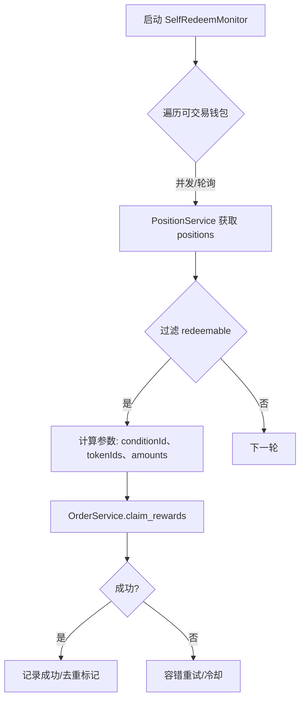
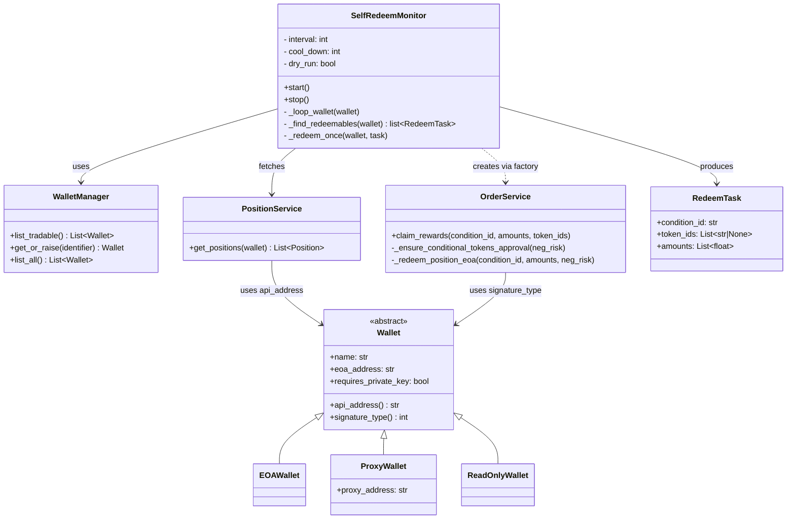

# [自持钱包自动 Redeem 监控] 设计文档

## 1. 背景

### 1.1 功能简介

为 poly_boost 核心增加“自持钱包自动 Redeem 监控”特性：按固定频率（默认每 60 秒）检查配置中的自持钱包（user_wallets）的活动头寸（positions），若发现可赎回（redeemable）的头寸，则自动发起 redeem 操作，帮助账户及时领取已解决市场的奖励，减少资金占用，避免人工操作遗漏。

### 1.2 需求与痛点

- 手动领取奖励效率低、易遗漏，且多钱包、多市场下负担重。
- 不同签名类型（EOA/Proxy/Safe）对应的“实际持币地址”不同，错误的地址选择会导致余额查询为 0 或交易失败（SafeMath overflow）。
- 需要具备去重与重试机制，避免重复 redeem 与不必要的 gas 浪费。

### 1.3 使用场景

- 机器人常驻运行，自动巡检自持钱包，检测可赎回的头寸并自动领取奖励。
- 支持多自持钱包并发监控；可按名称/白名单启用；支持 dry-run 演练模式。

## 2. 概要设计

1. 新增 SelfRedeemMonitor（核心调度器），按配置频率为每个“可交易”钱包独立轮询。
2. 通过 PositionService 按钱包的“API 查询地址”（与签名类型匹配）获取 positions，筛出 `redeemable == true` 的头寸。
3. 对每个可赎回头寸，调用 OrderService.claim_rewards 执行 redeem：在该方法中根据 signature_type 选择正确的余额地址与交易路径（EOA 直调 / ProxyFactory）。



### 2.1 模块划分

- SelfRedeemMonitor（新）：
  - 负责调度轮询、并发控制、去重与重试。
  - 依赖 WalletManager/PositionService/OrderService。
- WalletManager（已有）：
  - 统一装载与解析自持钱包；暴露正确的 API 查询地址（`wallet.api_address`）。
- PositionService（已有）：
  - 基于 `wallet.api_address` 查询钱包头寸数据。
- OrderService（已有）：
  - 核心 redeem 逻辑；已支持按 signature_type 选择正确地址与交易路径，并可基于 token_ids 查询实际余额后再 redeem。

### 2.2 核心流程

1. 读取配置，构建 WalletManager，筛选“可交易钱包”（具备私钥的 user_wallets）。
2. 周期性（默认 60s）调用 PositionService.get_positions(wallet)。
3. 过滤 `position.redeemable == true` 的头寸，准备参数：
   - `conditionId`
   - `tokenIds`（若可得，可传 [tokenIdYes, tokenIdNo] 以便后端查询实际余额）
   - `amounts`（若无 tokenIds，可按 size/outcomeIndex 推导，或置 [0,0] 并依赖后端余额查询）
4. 调用 OrderService.claim_rewards(condition_id, amounts, token_ids)。
5. 成功后记录去重状态（按钱包+conditionId），失败则进入带冷却的重试队列。

## 3. 数据模型/API设计

### 3.1 配置项（建议）

在 `config/config.example.yaml` 中建议新增/复用以下配置：

```yaml
auto_redeem:
  enabled: true
  poll_interval_seconds: 60  # 默认 60 秒
  include_wallets: []        # 可选：按钱包 name 进行白名单过滤
  exclude_wallets: []        # 可选：黑名单
  max_parallel_redeems: 3    # 并发 redeem 上限
  cool_down_seconds: 600     # 同一 condition 重试冷却
  dry_run: false             # 仅打印不落链
```

说明：
- 使用已有 `user_wallets` 段定义自持钱包：包括 `name`、`address`、`proxy_address`、`signature_type`、`private_key_env` 等（参考 config/config.example.yaml）。
- 若 `auto_redeem.enabled=false`，则不启动该模块。

### 3.2 签名类型与地址选择

遵循仓库既有规范（见 docs/SIGNATURE_TYPE_ADDRESS_FIX.md、docs/EOA_REDEEM_FIX.md）：

```
signature_type = 0 (EOA)           → API 查询与余额地址 = EOA address
signature_type = 1/2 (Proxy/Safe)  → API 查询与余额地址 = proxy_address
```

- 查询 positions：统一用 `wallet.api_address`（由 Wallet/WalletManager 抽象）。
- 执行 redeem：OrderService.claim_rewards 内部已按 `wallet.signature_type` 选择直调或 ProxyFactory 路径，并在提供 `token_ids` 时优先查询实际余额，避免 SafeMath overflow。

### 3.3 主要接口（内部）

```python
class SelfRedeemMonitor:
    def __init__(self, wallet_manager: WalletManager, position_svc: PositionService,
                 order_svc_factory: Callable[[Wallet], OrderService], cfg: dict): ...

    def start(self) -> None: ...  # 创建线程池/定时任务并发运行
    def stop(self) -> None: ...   # 优雅停止

    # 单钱包心跳
    def _tick_wallet(self, wallet: Wallet) -> None: ...

    # 查找可赎回头寸
    def _find_redeemables(self, wallet: Wallet) -> list[RedeemTask]: ...

    # 去重 & 组装参数 & 执行
    def _redeem_once(self, wallet: Wallet, task: RedeemTask) -> None: ...
```

其中 `RedeemTask` 可包含：`condition_id`、`token_ids: list[str|None]`、`suggested_amounts: list[float]`、`market_info`、`outcome_index` 等。

### 3.4 类图



## 4. 详细设计

### 4.5 启动与集成（core/main.py）

- 启动位置：在 `poly_boost/core/main.py` 的 `main()` 中，加载配置并初始化 `WalletMonitor`、`CopyTrader` 之后，按 `auto_redeem.enabled` 条件启动 `SelfRedeemMonitor`。
- 附着对象：不附着到已有 `WalletMonitor`，而是作为独立组件“挂”在 `main` 的生命周期上（与 `WalletMonitor`/`CopyTrader` 并行运行）。
- 线程模型：`SelfRedeemMonitor` 内部维护自己的线程池（每个可交易钱包一个或受 `max_parallel_redeems` 限制），与 `main` 的主线程解耦；`main` 的信号处理（SIGINT/SIGTERM）中调用 `self_redeem_monitor.stop()` 优雅退出。

参考伪代码（对 `poly_boost/core/main.py` 的集成）：

```python
from poly_boost.core.wallet_manager import WalletManager
from poly_boost.core.client_factory import ClientFactory
from polymarket_apis.clients.data_client import PolymarketDataClient
from poly_boost.services.position_service import PositionService
from poly_boost.services.order_service import OrderService

def main():
    config = load_config("config.yaml")
    api_cfg = config.get('polymarket_api', {})

    # 1) 构建钱包管理器
    wallet_manager = WalletManager.from_config(config)

    # 2) 共享客户端/服务（可复用 httpx 连接池）
    client_factory = ClientFactory(api_cfg)
    data_client = PolymarketDataClient()
    position_svc = PositionService(
        clob_client=None,  # 仅查询 positions 时可不需要 CLOB
        data_client=data_client,
        wallet_manager=wallet_manager,
    )

    # OrderService 需要按钱包创建（因签名类型/私钥不同），因此提供一个工厂
    def order_service_factory(wallet):
        clob = client_factory.get_clob_client(wallet)
        web3 = client_factory.get_web3_client(wallet)
        return OrderService(clob_client=clob, web3_client=web3, wallet=wallet)

    # 3) 条件启动自持钱包自动 redeem 监控
    auto_cfg = config.get('auto_redeem', {})
    if auto_cfg.get('enabled', True):
        self_redeem_monitor = SelfRedeemMonitor(
            wallet_manager=wallet_manager,
            position_svc=position_svc,
            order_svc_factory=order_service_factory,
            cfg=config,
        )
        self_redeem_monitor.start()  # 内部自有线程池

    # 4) 在 main 的信号处理里添加停止逻辑
    def signal_handler(sig, frame):
        if auto_cfg.get('enabled', True):
            self_redeem_monitor.stop()
        # 其他已有组件：monitor.stop() / activity_queue.shutdown() / trader.print_stats()
        sys.exit(0)
```

注意：
- `SelfRedeemMonitor` 与 `WalletMonitor` 互不依赖、互不阻塞；前者仅处理“自持钱包自动 redeem”，后者负责“外部钱包活动监控（推送到队列）”。
- `OrderService` 的实例按钱包构建，避免签名类型/私钥串线；`ClientFactory` 复用 HTTP 连接及凭证生命周期。

### 4.1 地址选择与调用路径

- 统一通过 `WalletManager` 获取 `Wallet` 实例：
  - `wallet.api_address`：用于 Data API 查询（positions/value）。
  - `wallet.signature_type`：用于链上路径选择：
    - 0=EOA：直接调用合约（ConditionalTokens 或 NegRiskAdapter）。
    - 1/2=Proxy/Safe：通过 ProxyFactory 代理调用。
- 余额查询优先用 `OrderService.claim_rewards(..., token_ids=...)` 的自动余额探测能力，避免 amounts 失真导致失败；若 `token_ids` 不可得，则按 `outcomeIndex` 推导 amounts。

### 4.2 去重与重试

- 去重键：`(wallet.api_address, condition_id)`。
- 内存级去重缓存（进程级 HashSet + LRU 过期）避免短时间重复 redeem。
- 冷却策略：失败进入冷却（默认 600s），过冷却后再尝试；对“非幂等错误”（如余额不足/已赎回）直接标记跳过。
- 可选：查询最近活动（ActivityService 或 DataClient）判断是否已有 REDEEM 事件，辅助去重。

### 4.3 并发与调度

- 线程池并发：按钱包数或 `max_parallel_redeems` 控制。
- 每钱包独立定时（`poll_interval_seconds`），互不阻塞。
- Stop 通过 `Event.wait(interval)` 可中断等待。

### 4.4 可观测性与安全

- 日志：
  - 钱包名称、signature_type、api_address。
  - 发现可赎回头寸数量、conditionId 列表。
  - 每次 redeem 发起/成功/失败的详细信息与交易哈希。
- 安全：仅对“可交易钱包”（有 `private_key_env`）执行链上操作；支持 `dry_run` 仅打印不发链；严格使用 `wallet.api_address`。

## 5. 伪代码实现

### 5.1 核心流程伪代码

```python
class SelfRedeemMonitor:
    def __init__(self, wallet_manager, position_svc, order_svc_factory, cfg):
        self.wallet_manager = wallet_manager
        self.position_svc = position_svc
        self.order_svc_factory = order_svc_factory
        self.cfg = cfg.get('auto_redeem', {})
        self.enabled = self.cfg.get('enabled', True)
        self.interval = self.cfg.get('poll_interval_seconds', 60)
        self.cool_down = self.cfg.get('cool_down_seconds', 600)
        self.dry_run = self.cfg.get('dry_run', False)
        self.allow = set(self.cfg.get('include_wallets', []) or [])
        self.deny = set(self.cfg.get('exclude_wallets', []) or [])
        self.dedupe = TTLCache(ttl=self.cool_down)  # (wallet_api, condition_id) → ts

    def start(self):
        if not self.enabled:
            log.info('Auto redeem disabled; skip start')
            return
        self.pool = ThreadPoolExecutor(max_workers=self.cfg.get('max_parallel_redeems', 3))
        for w in self.wallet_manager.list_tradable():
            if self.allow and w.name not in self.allow:
                continue
            if w.name in self.deny:
                continue
            self.pool.submit(self._loop_wallet, w)

    def stop(self):
        self.stop_event.set(); self.pool.shutdown(wait=True)

    def _loop_wallet(self, wallet):
        while not self.stop_event.is_set():
            try:
                tasks = self._find_redeemables(wallet)
                for t in tasks:
                    self._redeem_once(wallet, t)
            except Exception as e:
                log.error(f"wallet {wallet.name} tick failed: {e}")
            self.stop_event.wait(self.interval)

    def _find_redeemables(self, wallet):
        positions = self.position_svc.get_positions(wallet)  # uses wallet.api_address
        tasks = []
        for p in positions:
            if getattr(p, 'redeemable', False):
                cond = p.conditionId
                token_ids = getattr(p, 'tokenIds', None)  # [yes, no] if available
                amounts = [0.0, 0.0]
                # if token_ids missing, fallback by outcomeIndex/size
                if not token_ids and hasattr(p, 'outcomeIndex') and hasattr(p, 'size'):
                    if p.outcomeIndex == 0:
                        amounts = [float(p.size), 0.0]
                    else:
                        amounts = [0.0, float(p.size)]
                tasks.append(RedeemTask(condition_id=cond, token_ids=token_ids, amounts=amounts))
        return tasks

    def _redeem_once(self, wallet, task):
        key = (wallet.api_address.lower(), task.condition_id)
        if key in self.dedupe:
            return  # skip within cool_down
        log.info(f"Auto redeem: wallet={wallet.name} cond={task.condition_id}")
        if self.dry_run:
            log.info(f"[dry-run] claim_rewards({task.condition_id}, {task.amounts}, {task.token_ids})")
            self.dedupe.add(key); return
        svc = self.order_svc_factory(wallet)
        svc.claim_rewards(condition_id=task.condition_id, amounts=task.amounts, token_ids=task.token_ids)
        self.dedupe.add(key)
```

### 5.2 关键点说明

- 通过 `wallet.api_address` 与 `wallet.signature_type` 抽象，彻底解耦地址与签名类型差异：
  - Data API 查询地址统一正确；
  - Redeem 时 OrderService 负责区分 EOA/Proxy 路径，并在提供 `token_ids` 时优先查询实际余额，避免 SafeMath overflow。
- amounts 兜底策略：优先传 `token_ids` 让后端查链上余额；缺失时按 `outcomeIndex/size` 推导。
- 去重 TTL 防重复；失败进入冷却后重试，避免频繁打点。
