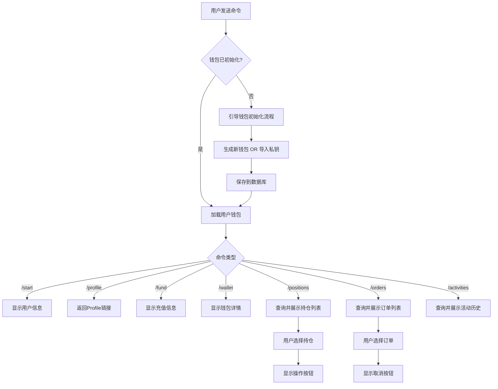
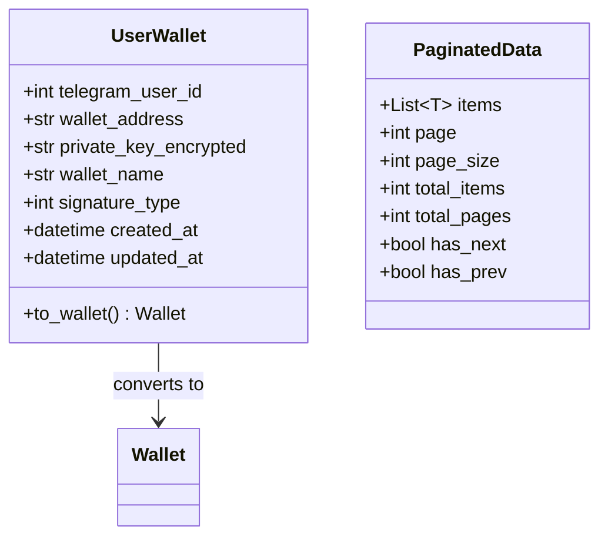
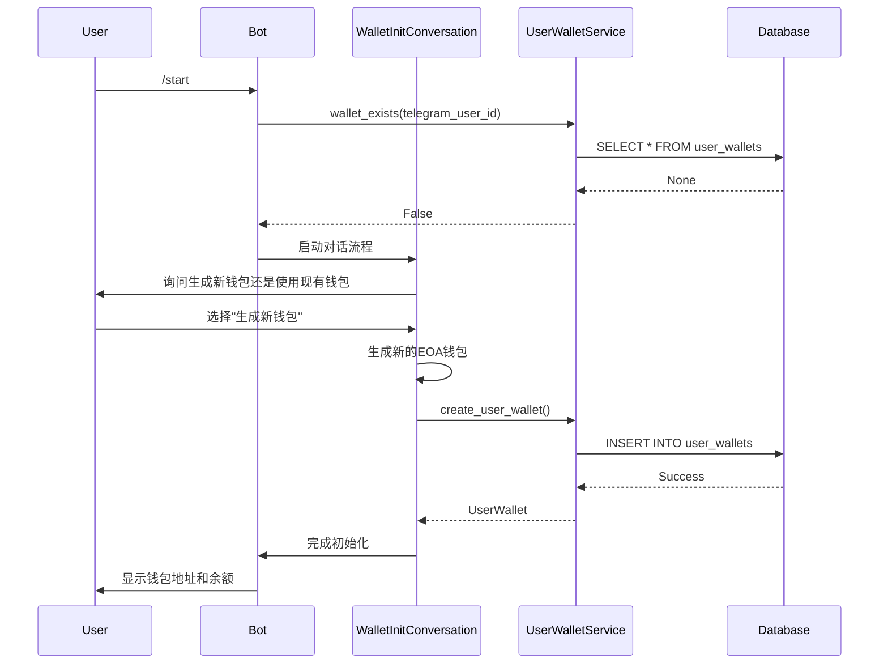
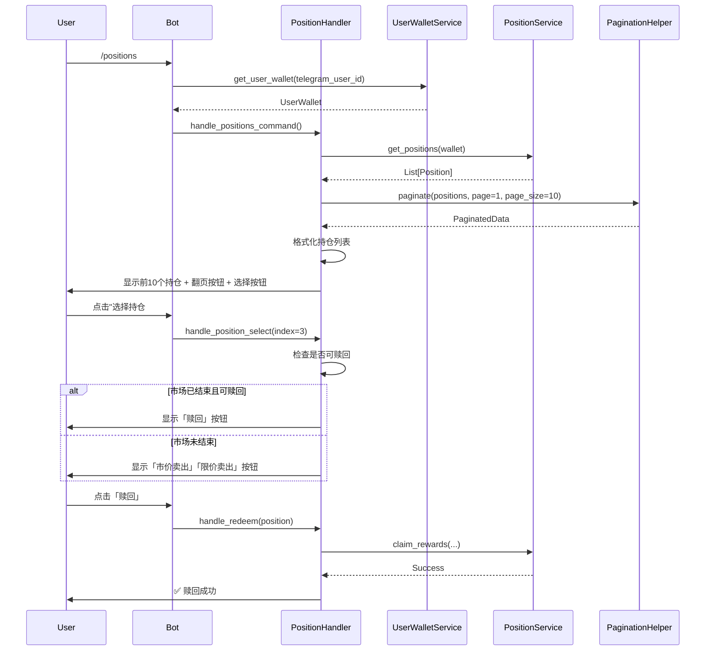
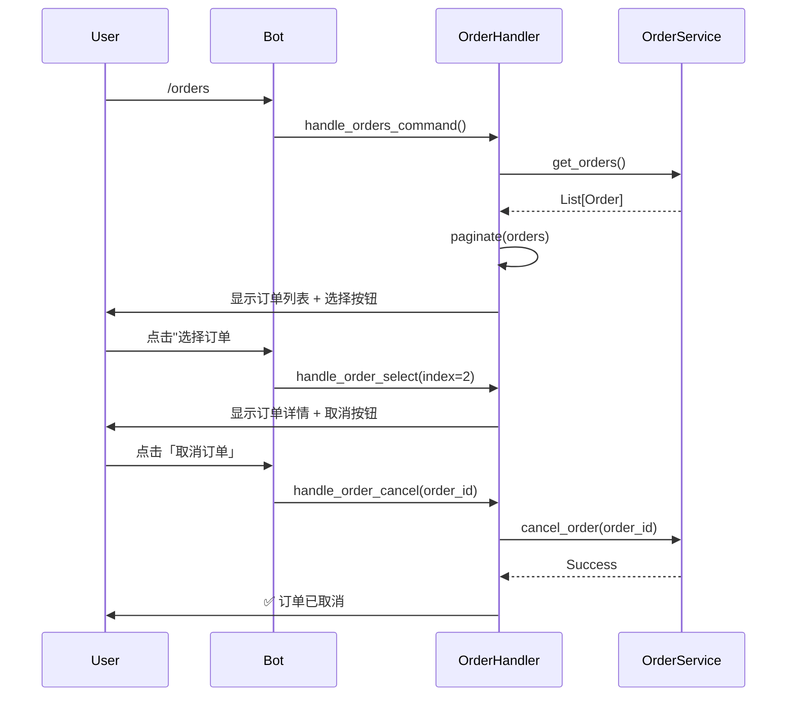
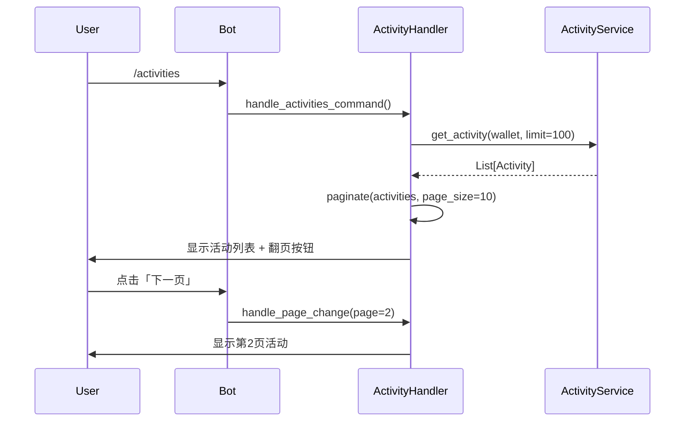

# Telegram Bot 钱包管理与交易功能设计文档

## 1. 背景

### 1.1 功能简介

为 Polymarket Copy Trading Bot 的 Telegram Bot 设计并实现完整的钱包管理和交易功能。该功能允许用户通过 Telegram 对话界面管理钱包、查看余额、管理持仓、订单和活动历史。

### 1.2 需求与痛点

**当前痛点：**
- 用户无法通过 Telegram Bot 管理自己的钱包
- 现有的 Bot 实现只有基础的持仓和交易功能，缺少完整的用户体验
- 用户需要手动记住钱包地址，没有持久化存储
- 没有钱包初始化流程和用户引导

**业务需求：**
1. **钱包管理**：用户需要能够创建新钱包或导入现有钱包，系统需要安全存储钱包信息（地址和私钥）
2. **用户信息查询**：用户需要快速查看钱包地址、余额和收益
3. **持仓管理**：用户需要查看和管理当前的市场持仓，支持赎回或卖出操作
4. **订单管理**：用户需要查看活跃订单并支持取消操作
5. **活动历史**：用户需要查看交易活动历史记录
6. **分页支持**：列表数据需要支持翻页，避免消息过长

### 1.3 使用场景

**场景 1：新用户初次使用**
1. 用户发送 `/start` 命令
2. Bot 询问用户是否要生成新钱包或使用现有钱包
3. 用户选择生成新钱包，Bot 生成并返回钱包地址
4. Bot 显示用户的基本信息（地址、余额）

**场景 2：查看和管理持仓**
1. 用户发送 `/positions` 命令
2. Bot 显示前10个持仓，并提供翻页按钮
3. 用户选择某个持仓（通过索引）
4. Bot 检查是否可赎回，显示相应的操作按钮（赎回/市价卖出/限价卖出）

**场景 3：查看和取消订单**
1. 用户发送 `/orders` 命令
2. Bot 显示活跃订单列表（分页）
3. 用户选择某个订单
4. Bot 显示订单详情和取消按钮

**场景 4：充值钱包**
1. 用户发送 `/fund` 命令
2. Bot 显示钱包地址（带二维码）和充值提示
3. 提示用户使用 Polygon 链的 USDC

## 2. 概要设计

整体实现思路：
1. 使用数据库（SQLite）持久化存储用户的钱包信息（telegram_user_id -> wallet）
2. 创建 [`UserWalletService`](poly_boost/services/user_wallet_service.py:1) 管理用户钱包的 CRUD 操作
3. 扩展现有的 bot handlers，实现各个命令的交互逻辑
4. 使用 ConversationHandler 管理多步骤交互流程（如钱包初始化）
5. 实现分页组件 [`PaginationHelper`](poly_boost/bot/utils/pagination.py:1) 处理列表翻页



### 2.1 模块划分

*   **[`UserWalletService`](poly_boost/services/user_wallet_service.py:1)**：负责用户钱包的数据库 CRUD 操作，关联 Telegram User ID 和 Wallet
*   **[`WalletHandler`](poly_boost/bot/handlers/wallet_handler.py:1)**：处理 `/start`、`/wallet`、`/fund`、`/profile` 等钱包相关命令
*   **[`PositionHandler`](poly_boost/bot/handlers/position_handler.py:1)** (扩展)：处理 `/positions` 命令，支持分页和持仓操作
*   **[`OrderHandler`](poly_boost/bot/handlers/order_handler.py:1)**：处理 `/orders` 命令，支持分页和订单取消
*   **[`ActivityHandler`](poly_boost/bot/handlers/activity_handler.py:1)**：处理 `/activities` 命令，支持分页
*   **[`PaginationHelper`](poly_boost/bot/utils/pagination.py:1)**：通用分页组件，管理列表数据的分页显示
*   **[`WalletInitConversation`](poly_boost/bot/conversations/wallet_init.py:1)**：钱包初始化对话流程，使用 ConversationHandler

### 2.2 核心流程

1.  **钱包初始化流程**：
    - 用户首次使用 `/start` 时，检查数据库中是否存在该用户的钱包
    - 如果不存在，启动 ConversationHandler，询问用户选择（生成/导入）
    - 根据用户选择，生成新钱包或请求私钥
    - 将钱包信息保存到数据库，关联 telegram_user_id

2.  **分页查询流程**：
    - 用户发送命令（如 `/positions`）
    - Handler 从服务层获取数据，使用 PaginationHelper 分页
    - 渲染当前页数据和翻页按钮（上一页/下一页）
    - 用户点击翻页按钮，更新 callback_query，重新渲染

3.  **持仓操作流程**：
    - 用户在持仓列表中选择某个持仓（通过 index）
    - Handler 获取该持仓的详细信息
    - 检查是否可赎回（市场已结束且持有正确结果）
    - 显示相应的操作按钮（赎回/市价卖出/限价卖出）
    - 用户点击按钮，调用 [`OrderService`](poly_boost/services/order_service.py:1) 执行操作

## 3. 数据模型/类图/API设计

### 3.1 数据结构

**数据库表：`user_wallets`**

```sql
CREATE TABLE user_wallets (
    telegram_user_id INTEGER PRIMARY KEY,
    wallet_address TEXT NOT NULL,
    private_key_encrypted TEXT NOT NULL,
    wallet_name TEXT,
    signature_type INTEGER DEFAULT 0,
    created_at TIMESTAMP DEFAULT CURRENT_TIMESTAMP,
    updated_at TIMESTAMP DEFAULT CURRENT_TIMESTAMP
);
```

**用户钱包数据模型**



### 3.2 API 设计

**UserWalletService 接口**

```python
class UserWalletService:
    def create_user_wallet(
        self,
        telegram_user_id: int,
        wallet_address: str,
        private_key: str,
        wallet_name: Optional[str] = None,
        signature_type: int = 0
    ) -> UserWallet:
        """创建用户钱包记录"""
        
    def get_user_wallet(self, telegram_user_id: int) -> Optional[UserWallet]:
        """获取用户钱包"""
        
    def update_user_wallet(self, telegram_user_id: int, **kwargs) -> UserWallet:
        """更新用户钱包信息"""
        
    def delete_user_wallet(self, telegram_user_id: int) -> bool:
        """删除用户钱包"""
        
    def wallet_exists(self, telegram_user_id: int) -> bool:
        """检查用户钱包是否存在"""
```

**PaginationHelper 接口**

```python
class PaginationHelper:
    @staticmethod
    def paginate(
        items: List[T],
        page: int = 1,
        page_size: int = 10
    ) -> PaginatedData[T]:
        """分页数据"""
        
    @staticmethod
    def create_pagination_keyboard(
        paginated_data: PaginatedData,
        callback_prefix: str,
        additional_buttons: Optional[List[InlineKeyboardButton]] = None
    ) -> InlineKeyboardMarkup:
        """创建分页键盘"""
```

## 4. 详细设计

### 4.1 流程一：钱包初始化流程



**流程说明：**

1. 用户发送 `/start` 命令
2. Bot 检查数据库中是否存在该用户的钱包记录
3. 如果不存在，启动 ConversationHandler
4. 显示选择按钮：「生成新钱包」「使用现有钱包」
5. 用户选择「生成新钱包」：
   - 使用 [`Account.create()`](poly_boost/bot/conversations/wallet_init.py:45) 生成新的 EOA 钱包
   - 将地址和加密后的私钥保存到数据库
   - 返回钱包地址给用户
6. 用户选择「使用现有钱包」：
   - 提示用户输入私钥
   - 验证私钥格式
   - 从私钥恢复地址
   - 保存到数据库

#### 4.1.1 生成新钱包步骤

```python
from eth_account import Account

# 1. 生成新账户
account = Account.create()
wallet_address = account.address
private_key = account.key.hex()

# 2. 加密私钥（使用简单的环境变量密钥）
encrypted_key = encrypt_private_key(private_key, encryption_key)

# 3. 保存到数据库
user_wallet_service.create_user_wallet(
    telegram_user_id=user.id,
    wallet_address=wallet_address,
    private_key_encrypted=encrypted_key,
    wallet_name=f"Wallet_{user.id}"
)
```

#### 4.1.2 导入现有钱包步骤

```python
# 1. 用户输入私钥
private_key = update.message.text.strip()

# 2. 验证私钥并恢复地址
try:
    account = Account.from_key(private_key)
    wallet_address = account.address
except Exception as e:
    # 提示用户私钥格式错误
    return RETRY_INPUT

# 3. 加密并保存
encrypted_key = encrypt_private_key(private_key, encryption_key)
user_wallet_service.create_user_wallet(...)
```

### 4.2 流程二：持仓列表查询与操作



**流程说明：**

1. 用户发送 `/positions` 命令
2. Handler 从数据库加载用户钱包，转换为 [`Wallet`](poly_boost/core/wallet.py:17) 对象
3. 调用 [`PositionService.get_positions()`](poly_boost/services/position_service.py:74) 获取所有持仓
4. 使用 [`PaginationHelper.paginate()`](poly_boost/bot/utils/pagination.py:15) 对数据分页
5. 渲染当前页的持仓列表（每行显示：索引、市场名称、outcome、数量、价值）
6. 添加翻页按钮和选择按钮
7. 用户点击选择某个持仓，显示详情和操作按钮
8. 用户执行操作（赎回/卖出），调用对应的服务方法

#### 4.2.1 持仓列表格式化

```python
def format_positions_message(paginated_data: PaginatedData[Position]) -> str:
    message = f"📊 持仓列表 (第 {paginated_data.page}/{paginated_data.total_pages} 页)\n\n"
    
    for i, position in enumerate(paginated_data.items, start=(paginated_data.page-1)*paginated_data.page_size):
        market_name = position.market_question[:30] + "..."
        outcome = "✅" if position.outcome == "Yes" else "❌"
        size = position.size
        value = position.value
        
        message += f"{i+1}. {market_name}\n"
        message += f"   {outcome} {size:.2f} shares (${value:.2f})\n\n"
    
    return message
```

#### 4.2.2 持仓操作按钮生成

```python
def create_position_action_buttons(position: Position) -> InlineKeyboardMarkup:
    buttons = []
    
    # 检查是否可赎回
    if position.is_redeemable:
        buttons.append([
            InlineKeyboardButton("🎁 赎回", callback_data=f"pos_redeem_{position.token_id}")
        ])
    else:
        buttons.append([
            InlineKeyboardButton("💰 市价卖出", callback_data=f"pos_sell_market_{position.token_id}"),
            InlineKeyboardButton("📈 限价卖出", callback_data=f"pos_sell_limit_{position.token_id}")
        ])
    
    buttons.append([InlineKeyboardButton("🔙 返回", callback_data="pos_list")])
    return InlineKeyboardMarkup(buttons)
```

### 4.3 流程三：订单列表与取消



**流程说明：**

1. 用户发送 `/orders` 命令
2. Handler 调用 [`OrderService.get_orders()`](poly_boost/services/order_service.py:526) 获取活跃订单
3. 分页并显示订单列表（包含：订单ID、市场名称、方向、价格、数量、状态）
4. 用户选择某个订单，显示详情和取消按钮
5. 用户点击取消，调用 [`OrderService.cancel_order()`](poly_boost/services/order_service.py:590)

### 4.4 流程四：活动历史查询



**流程说明：**

1. 用户发送 `/activities` 命令
2. Handler 调用 [`ActivityService.get_activity()`](poly_boost/services/activity_service.py:70) 获取活动历史
3. 分页显示（每页10条）
4. 每条活动显示：时间、类型、市场名称、方向、数量、价格

## 5. 伪代码实现

### 5.1 钱包初始化对话流程伪代码

```python
from telegram.ext import ConversationHandler, CommandHandler, MessageHandler, CallbackQueryHandler

# 状态常量
WALLET_CHOICE, INPUT_PRIVATE_KEY = range(2)

async def start_command(update: Update, context: ContextTypes.DEFAULT_TYPE):
    user_id = update.effective_user.id
    
    # 检查是否已有钱包
    if user_wallet_service.wallet_exists(user_id):
        wallet = user_wallet_service.get_user_wallet(user_id)
        balance = wallet_service.get_balance(wallet.to_wallet())
        
        await update.message.reply_text(
            f"👛 您的钱包信息:\n"
            f"地址: `{wallet.wallet_address}`\n"
            f"余额: ${balance:.2f} USDC",
            parse_mode="Markdown"
        )
        return ConversationHandler.END
    
    # 启动钱包初始化流程
    keyboard = [
        [InlineKeyboardButton("🆕 生成新钱包", callback_data="wallet_generate")],
        [InlineKeyboardButton("📥 使用现有钱包", callback_data="wallet_import")]
    ]
    
    await update.message.reply_text(
        "欢迎使用 Polymarket Bot!\n\n"
        "请选择钱包设置方式:",
        reply_markup=InlineKeyboardMarkup(keyboard)
    )
    
    return WALLET_CHOICE

async def wallet_choice_callback(update: Update, context: ContextTypes.DEFAULT_TYPE):
    query = update.callback_query
    await query.answer()
    
    if query.data == "wallet_generate":
        # 生成新钱包
        account = Account.create()
        wallet_address = account.address
        private_key = account.key.hex()
        
        # 加密并保存
        encrypted_key = encrypt_private_key(private_key, ENCRYPTION_KEY)
        user_wallet_service.create_user_wallet(
            telegram_user_id=query.from_user.id,
            wallet_address=wallet_address,
            private_key_encrypted=encrypted_key
        )
        
        await query.edit_message_text(
            f"✅ 钱包创建成功!\n\n"
            f"地址: `{wallet_address}`\n\n"
            f"⚠️ 请务必保存以下私钥:\n"
            f"`{private_key}`\n\n"
            f"私钥丢失将无法找回!",
            parse_mode="Markdown"
        )
        
        return ConversationHandler.END
    
    elif query.data == "wallet_import":
        await query.edit_message_text(
            "请发送您的钱包私钥:\n"
            "(格式: 0x...)"
        )
        return INPUT_PRIVATE_KEY

async def receive_private_key(update: Update, context: ContextTypes.DEFAULT_TYPE):
    private_key = update.message.text.strip()
    
    try:
        # 验证私钥
        account = Account.from_key(private_key)
        wallet_address = account.address
        
        # 加密并保存
        encrypted_key = encrypt_private_key(private_key, ENCRYPTION_KEY)
        user_wallet_service.create_user_wallet(
            telegram_user_id=update.effective_user.id,
            wallet_address=wallet_address,
            private_key_encrypted=encrypted_key
        )
        
        # 删除包含私钥的消息
        await update.message.delete()
        
        await update.message.reply_text(
            f"✅ 钱包导入成功!\n"
            f"地址: `{wallet_address}`",
            parse_mode="Markdown"
        )
        
        return ConversationHandler.END
        
    except Exception as e:
        await update.message.reply_text(
            "❌ 私钥格式错误，请重新输入:"
        )
        return INPUT_PRIVATE_KEY

# ConversationHandler 配置
wallet_init_handler = ConversationHandler(
    entry_points=[CommandHandler("start", start_command)],
    states={
        WALLET_CHOICE: [CallbackQueryHandler(wallet_choice_callback)],
        INPUT_PRIVATE_KEY: [MessageHandler(filters.TEXT & ~filters.COMMAND, receive_private_key)]
    },
    fallbacks=[CommandHandler("cancel", cancel_command)]
)
```

### 5.2 持仓列表分页伪代码

```python
async def handle_positions_command(update: Update, context: ContextTypes.DEFAULT_TYPE):
    user_id = update.effective_user.id
    
    # 加载用户钱包
    user_wallet = user_wallet_service.get_user_wallet(user_id)
    if not user_wallet:
        await update.message.reply_text("请先使用 /start 初始化钱包")
        return
    
    wallet = user_wallet.to_wallet()
    
    # 获取持仓数据
    positions = position_service.get_positions(wallet)
    
    # 分页
    page = context.user_data.get('positions_page', 1)
    paginated = PaginationHelper.paginate(positions, page=page, page_size=10)
    
    # 格式化消息
    message = format_positions_message(paginated)
    
    # 创建按钮
    buttons = []
    
    # 选择持仓按钮
    for i in range(len(paginated.items)):
        global_index = (page - 1) * 10 + i
        buttons.append([
            InlineKeyboardButton(
                f"选择 #{global_index + 1}",
                callback_data=f"pos_select_{global_index}"
            )
        ])
    
    # 翻页按钮
    pagination_buttons = PaginationHelper.create_pagination_keyboard(
        paginated, 
        callback_prefix="pos_page"
    )
    
    buttons.extend(pagination_buttons.inline_keyboard)
    
    await update.message.reply_text(
        message,
        reply_markup=InlineKeyboardMarkup(buttons),
        parse_mode="Markdown"
    )

async def handle_position_select(update: Update, context: ContextTypes.DEFAULT_TYPE):
    query = update.callback_query
    await query.answer()
    
    # 解析索引
    index = int(query.data.split("_")[-1])
    
    # 重新获取持仓数据
    user_wallet = user_wallet_service.get_user_wallet(query.from_user.id)
    positions = position_service.get_positions(user_wallet.to_wallet())
    
    if index >= len(positions):
        await query.edit_message_text("持仓不存在")
        return
    
    position = positions[index]
    
    # 格式化持仓详情
    message = format_position_detail(position)
    
    # 创建操作按钮
    buttons = create_position_action_buttons(position)
    
    await query.edit_message_text(
        message,
        reply_markup=buttons,
        parse_mode="Markdown"
    )
```

### 5.3 订单取消伪代码

```python
async def handle_orders_command(update: Update, context: ContextTypes.DEFAULT_TYPE):
    user_id = update.effective_user.id
    user_wallet = user_wallet_service.get_user_wallet(user_id)
    
    if not user_wallet:
        await update.message.reply_text("请先使用 /start 初始化钱包")
        return
    
    # 获取活跃订单
    orders = order_service.get_orders()
    
    if not orders:
        await update.message.reply_text("当前没有活跃订单")
        return
    
    # 分页
    page = context.user_data.get('orders_page', 1)
    paginated = PaginationHelper.paginate(orders, page=page, page_size=10)
    
    # 格式化消息
    message = format_orders_message(paginated)
    
    # 创建按钮（选择 + 翻页）
    buttons = create_order_selection_buttons(paginated, page)
    
    await update.message.reply_text(
        message,
        reply_markup=InlineKeyboardMarkup(buttons),
        parse_mode="Markdown"
    )

async def handle_order_cancel(update: Update, context: ContextTypes.DEFAULT_TYPE):
    query = update.callback_query
    await query.answer()
    
    # 解析 order_id
    order_id = query.data.split("_")[-1]
    
    try:
        # 调用 OrderService 取消订单
        result = order_service.cancel_order(order_id)
        
        await query.edit_message_text(
            f"✅ 订单已取消\n"
            f"订单ID: `{order_id}`",
            parse_mode="Markdown"
        )
    except Exception as e:
        await query.edit_message_text(
            f"❌ 取消订单失败: {str(e)}"
        )
```

### 5.4 通用分页组件伪代码

```python
from typing import TypeVar, Generic, List
from dataclasses import dataclass

T = TypeVar('T')

@dataclass
class PaginatedData(Generic[T]):
    items: List[T]
    page: int
    page_size: int
    total_items: int
    total_pages: int
    has_next: bool
    has_prev: bool

class PaginationHelper:
    @staticmethod
    def paginate(items: List[T], page: int = 1, page_size: int = 10) -> PaginatedData[T]:
        """对列表数据进行分页"""
        total_items = len(items)
        total_pages = (total_items + page_size - 1) // page_size  # 向上取整
        
        # 边界检查
        if page < 1:
            page = 1
        if page > total_pages and total_pages > 0:
            page = total_pages
        
        # 计算切片
        start_index = (page - 1) * page_size
        end_index = start_index + page_size
        page_items = items[start_index:end_index]
        
        return PaginatedData(
            items=page_items,
            page=page,
            page_size=page_size,
            total_items=total_items,
            total_pages=total_pages,
            has_next=page < total_pages,
            has_prev=page > 1
        )
    
    @staticmethod
    def create_pagination_keyboard(
        paginated_data: PaginatedData,
        callback_prefix: str
    ) -> InlineKeyboardMarkup:
        """创建翻页按钮"""
        buttons = []
        
        nav_buttons = []
        if paginated_data.has_prev:
            nav_buttons.append(
                InlineKeyboardButton("⬅️ 上一页", callback_data=f"{callback_prefix}_{paginated_data.page - 1}")
            )
        
        nav_buttons.append(
            InlineKeyboardButton(
                f"{paginated_data.page}/{paginated_data.total_pages}",
                callback_data="noop"
            )
        )
        
        if paginated_data.has_next:
            nav_buttons.append(
                InlineKeyboardButton("➡️ 下一页", callback_data=f"{callback_prefix}_{paginated_data.page + 1}")
            )
        
        buttons.append(nav_buttons)
        return InlineKeyboardMarkup(buttons)