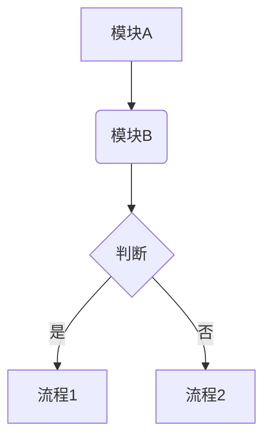
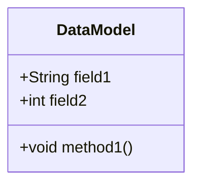
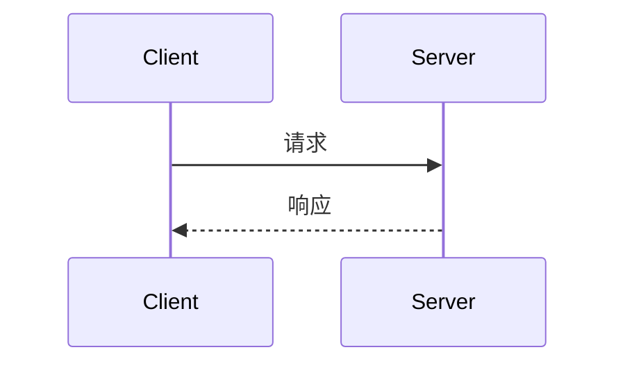

# [特性名称] 设计文档

## 1. 背景

### 1.1 功能简介

（简要介绍该特性是什么，解决了什么问题。）

### 1.2 需求与痛点

（详细阐述为什么需要开发该特性。可以包括当前系统存在的痛点、业务发展的需求、性能优化的需要等。）

### 1.3 使用场景

（描述该特性的具体应用场景，帮助理解其价值和使用方式。）

## 2. 概要设计

（用几句话描述特性的整体实现思路，让读者对实现方案有一个快速的了解。 建议用这样的形式：
1. xxx
2. xxx
3. xxx）



### 2.1 模块划分

（介绍该特性实现涉及的主要模块，以及各个模块的职责。）

*   **模块A**：负责...
*   **模块B**：负责...
*   **模块C**：负责...

### 2.2 核心流程

（简述实现该特性的核心流程，可以用流程图辅助说明。）

1.  ...
2.  ...
3.  ...

## 3. 数据模型/类图/API设计

### 3.1 数据结构

（介绍该特性涉及到的核心数据结构、存储模型或文件格式。）



### 3.2 API 设计

（列出该特性对外暴露的接口或对内提供的核心方法定义。）

```java
public interface FeatureAPI {
    void newApiMethod(String param1, int param2);
}
```

## 4. 详细设计

（详细描述每个模块或流程的具体实现细节。）

### 4.1 流程/模块一：[名称]



**流程说明：**

1. ...（第一步的具体操作）
2. ...（第二步的具体操作）
3. ...（第三步的具体操作）

#### 4.1.1 步骤一

...

#### 4.1.2 步骤二

...

### 4.2 流程/模块二：[名称]

...

## 5. 伪代码实现

### 5.1 核心流程一伪代码

```java
// 描述核心流程一的伪代码实现
function processFeatureOne(data) {
    if (data is not valid) {
        throw new Exception("Invalid data");
    }
    // ... 伪代码逻辑
    return result;
}
```

### 5.2 核心流程二伪代码

```java
// 描述核心流程二的伪代码实现
class FeatureHandler {
    handle(request) {
        // ... 伪代码逻辑
    }
}
```