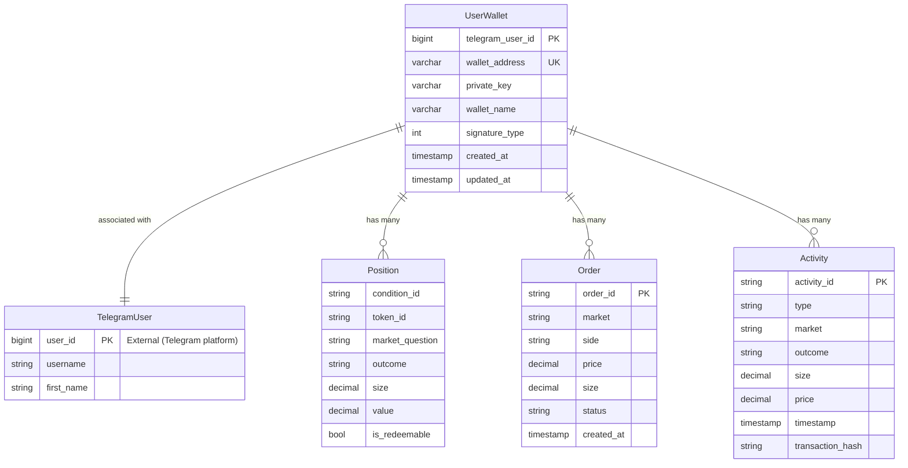

# Phase 1: Data Model Design

**Feature**: Telegram Bot Wallet Management & Trading
**Date**: 2025-11-05
**Status**: Complete

## Overview

This document defines the data model for the Telegram bot wallet management feature, including database schema, domain entities, and data flow patterns. The design follows the existing peewee ORM pattern used in the poly-boost project.

## Database Schema

### UserWallet Table

**Purpose**: Store the association between Telegram users and their cryptocurrency wallets.

**Schema Definition** (peewee ORM):

```python
from peewee import Model, BigIntegerField, CharField, IntegerField, DateTimeField
from datetime import datetime

class UserWallet(Model):
    """
    User wallet association for Telegram bot users.

    Maps Telegram user IDs to Ethereum wallet credentials.
    Private keys stored in plaintext per FR-019 with strict access controls.
    """

    telegram_user_id = BigIntegerField(primary_key=True, index=True)
    """
    Telegram user ID (64-bit integer).
    Primary key to ensure one wallet per user.
    Indexed for fast lookups.
    """

    wallet_address = CharField(max_length=42, unique=True, index=True)
    """
    Ethereum wallet address (checksum format).
    Format: 0x + 40 hexadecimal characters (42 total).
    Unique constraint prevents duplicate wallets.
    Indexed for reverse lookups (wallet → user).
    """

    private_key = CharField(max_length=66)
    """
    Ethereum private key (plaintext per FR-019).
    Format: 0x + 64 hexadecimal characters (66 total).
    NOT indexed (would leak information about key distribution).
    NOT encrypted in v1 (access controls are security boundary).
    """

    wallet_name = CharField(max_length=100, null=True)
    """
    Optional user-defined wallet nickname.
    Default: None (display as "Wallet {telegram_user_id}").
    """

    signature_type = IntegerField(default=0)
    """
    Wallet signature type for future extensibility.
    Values:
      0 = EOA (Externally Owned Account) - standard private key
      1 = AA (Account Abstraction) - future support for smart contract wallets
    Default: 0 (EOA).
    """

    created_at = DateTimeField(default=datetime.now)
    """
    Timestamp when wallet was first associated.
    Immutable after creation.
    """

    updated_at = DateTimeField(default=datetime.now)
    """
    Timestamp of last update (e.g., wallet_name changed).
    Auto-updated on save.
    """

    class Meta:
        table_name = 'user_wallets'
        indexes = (
            (('telegram_user_id',), True),  # Unique index (primary key)
            (('wallet_address',), True),    # Unique index
        )

    def to_wallet(self) -> 'Wallet':
        """
        Convert to poly_boost.core.wallet.Wallet for use with services.

        Returns:
            Wallet: Wallet object for trading operations.
        """
        from poly_boost.core.wallet import Wallet
        return Wallet(
            address=self.wallet_address,
            private_key=self.private_key,
            signature_type=self.signature_type
        )
```

**SQL Migration** (for manual execution or Alembic):

```sql
CREATE TABLE user_wallets (
    telegram_user_id BIGINT PRIMARY KEY,
    wallet_address VARCHAR(42) NOT NULL UNIQUE,
    private_key VARCHAR(66) NOT NULL,
    wallet_name VARCHAR(100),
    signature_type INTEGER DEFAULT 0,
    created_at TIMESTAMP DEFAULT CURRENT_TIMESTAMP,
    updated_at TIMESTAMP DEFAULT CURRENT_TIMESTAMP
);

-- Indexes
CREATE UNIQUE INDEX idx_user_wallets_telegram_user_id ON user_wallets(telegram_user_id);
CREATE UNIQUE INDEX idx_user_wallets_wallet_address ON user_wallets(wallet_address);

-- Trigger for updated_at (PostgreSQL)
CREATE OR REPLACE FUNCTION update_updated_at_column()
RETURNS TRIGGER AS $$
BEGIN
    NEW.updated_at = NOW();
    RETURN NEW;
END;
$$ LANGUAGE plpgsql;

CREATE TRIGGER update_user_wallets_updated_at
BEFORE UPDATE ON user_wallets
FOR EACH ROW
EXECUTE FUNCTION update_updated_at_column();
```

**Constraints**:
- `telegram_user_id` PRIMARY KEY: One wallet per Telegram user
- `wallet_address` UNIQUE: Prevents duplicate wallet registrations
- `private_key` NOT NULL: Wallet cannot exist without private key
- `created_at`, `updated_at` NOT NULL: Timestamps always present

**Retention Policy** (per FR-020):
- User wallet data retained **indefinitely**
- No automatic deletion or expiration
- Manual deletion only via admin operation (future feature)

---

## Domain Entities

### 1. UserWallet (Database Entity)

**Responsibility**: Persistent storage of user-wallet associations.

**Attributes**:
| Attribute | Type | Nullable | Description |
|-----------|------|----------|-------------|
| telegram_user_id | int (64-bit) | No | Telegram user identifier |
| wallet_address | str (42 chars) | No | Ethereum address (0x...) |
| private_key | str (66 chars) | No | Private key (0x...) |
| wallet_name | str | Yes | Optional nickname |
| signature_type | int | No | 0=EOA, 1=AA (future) |
| created_at | datetime | No | Creation timestamp |
| updated_at | datetime | No | Last update timestamp |

**Methods**:
- `to_wallet() -> Wallet`: Convert to core.wallet.Wallet for trading operations

**Validation Rules**:
- `telegram_user_id`: Must be positive 64-bit integer
- `wallet_address`: Must match `^0x[0-9a-fA-F]{40}$` (checksum validated separately)
- `private_key`: Must match `^0x[0-9a-fA-F]{64}$`
- `wallet_name`: Optional, max 100 characters
- `signature_type`: Must be 0 or 1

---

### 2. Position (Existing Entity)

**Responsibility**: Represents user's share holdings in prediction markets.

**Source**: `poly_boost/services/position_service.py`

**Key Attributes**:
- `condition_id`: Market identifier
- `token_id`: Specific outcome token ID
- `market_question`: Human-readable market description
- `outcome`: "Yes" or "No" (or custom for multi-outcome markets)
- `size`: Number of shares held (decimal)
- `value`: Current USD value of position (decimal)
- `is_redeemable`: Computed property (market finalized + winning outcome)

**Used By**: PositionHandler for /positions command

---

### 3. Order (Existing Entity)

**Responsibility**: Represents active limit orders.

**Source**: `poly_boost/services/order_service.py`

**Key Attributes**:
- `order_id`: Unique order identifier
- `market`: Market information
- `side`: "BUY" or "SELL"
- `price`: Limit price (decimal, 0.00-1.00 for binary markets)
- `size`: Order quantity (decimal)
- `status`: "LIVE", "MATCHED", "CANCELLED"
- `created_at`: Order creation timestamp

**Used By**: OrderHandler for /orders command and cancellation

---

### 4. Activity (Existing Entity)

**Responsibility**: Represents historical trading activity.

**Source**: `poly_boost/services/activity_service.py`

**Key Attributes**:
- `activity_id`: Unique activity identifier
- `type`: "BUY", "SELL", "REDEEM"
- `market`: Market information
- `outcome`: Outcome traded
- `size`: Quantity (decimal)
- `price`: Execution price (decimal)
- `timestamp`: Activity timestamp
- `transaction_hash`: Blockchain transaction ID

**Used By**: ActivityHandler for /activities command

---

### 5. PaginatedData[T] (Generic Utility Entity)

**Responsibility**: Container for paginated list data.

**Definition**:

```python
from typing import TypeVar, Generic, List
from dataclasses import dataclass

T = TypeVar('T')

@dataclass
class PaginatedData(Generic[T]):
    """
    Generic paginated data container.

    Type parameter T can be Position, Order, Activity, or any list item type.
    """

    items: List[T]
    """Current page items (max page_size items)."""

    page: int
    """Current page number (1-indexed)."""

    page_size: int
    """Items per page (default 10)."""

    total_items: int
    """Total items across all pages."""

    total_pages: int
    """Total number of pages (calculated)."""

    has_next: bool
    """True if there are more pages after current page."""

    has_prev: bool
    """True if there are pages before current page."""

    @property
    def start_index(self) -> int:
        """0-based start index of first item on current page."""
        return (self.page - 1) * self.page_size

    @property
    def end_index(self) -> int:
        """0-based end index (exclusive) of last item on current page."""
        return self.start_index + len(self.items)

    def is_empty(self) -> bool:
        """True if no items in entire dataset."""
        return self.total_items == 0

    def is_single_page(self) -> bool:
        """True if only one page exists."""
        return self.total_pages <= 1
```

**Used By**: PaginationHelper utility, all list handlers (positions, orders, activities)

---

## Data Flow Patterns

### 1. Wallet Initialization Flow

```
User → Bot → WalletInitConversation → UserWalletService → Database
                                            ↓
                                    Generate/Validate Wallet
                                            ↓
                                    Store UserWallet Record
                                            ↓
                                    Return to Bot → User
```

**Data Transformations**:
1. **User Input**: Telegram message (private key) or button click (generate new)
2. **Validation**: Check format (0x prefix, 66 chars, valid hex) or generate new
3. **Storage**: Create UserWallet record with telegram_user_id as key
4. **Output**: Display wallet address to user, delete private key message

---

### 2. Position Query Flow

```
User → Bot → PositionHandler → UserWalletService.get_user_wallet()
                    ↓                       ↓
            Get telegram_user_id    Fetch UserWallet from DB
                    ↓                       ↓
            UserWallet.to_wallet()   Convert to Wallet object
                    ↓
            PositionService.get_positions(wallet)
                    ↓
            Fetch from Polymarket API
                    ↓
            PaginationHelper.paginate(positions)
                    ↓
            Format message + buttons
                    ↓
            Send to User
```

**Data Transformations**:
1. **User Input**: /positions command
2. **User Lookup**: telegram_user_id → UserWallet record
3. **Wallet Conversion**: UserWallet → Wallet object (for API calls)
4. **API Fetch**: Wallet address → List[Position] from Polymarket
5. **Pagination**: List[Position] → PaginatedData[Position]
6. **Formatting**: PaginatedData → Telegram message + InlineKeyboard
7. **Output**: Send message to user

---

### 3. Order Cancellation Flow

```
User → Bot → OrderHandler → UserWalletService.get_user_wallet()
                 ↓                      ↓
        Parse order_id from      Fetch UserWallet
        callback_data                  ↓
                 ↓            UserWallet.to_wallet()
                 ↓                      ↓
        OrderService.cancel_order(wallet, order_id)
                 ↓
        Submit cancellation to Polymarket API
                 ↓
        Update Bot → User (confirmation or error)
```

**Data Transformations**:
1. **User Input**: Callback query with `cancel_order_{order_id}`
2. **Parsing**: Extract order_id from callback_data
3. **User Lookup**: telegram_user_id → UserWallet → Wallet
4. **API Call**: Cancel order via Polymarket CLOB API
5. **Output**: Success/error message to user

---

## Entity Relationships



**Notes**:
- TelegramUser is external (managed by Telegram platform, not stored locally)
- Position, Order, Activity are NOT stored locally (fetched from Polymarket API on demand)
- UserWallet is the ONLY persistent local entity for this feature

---

## Validation Rules

### UserWallet Validation

**Field-Level Validation**:

| Field | Rule | Error Message |
|-------|------|---------------|
| telegram_user_id | Must be positive 64-bit int | "Invalid Telegram user ID" |
| wallet_address | Must match `^0x[0-9a-fA-F]{40}$` | "Invalid wallet address format" |
| wallet_address | Must pass checksum validation (web3.py) | "Invalid wallet address checksum" |
| private_key | Must match `^0x[0-9a-fA-F]{64}$` | "Invalid private key format" |
| private_key | Must derive valid address (eth_account) | "Invalid private key" |
| wallet_name | Max 100 characters | "Wallet name too long (max 100 chars)" |
| signature_type | Must be 0 or 1 | "Invalid signature type" |

**Entity-Level Validation**:
- wallet_address must be unique across all records
- telegram_user_id must be unique (primary key)
- Private key must derive the same address as wallet_address

**Validation Implementation**:

```python
from web3 import Web3
from eth_account import Account

def validate_wallet_address(address: str) -> bool:
    """Validate Ethereum address format and checksum."""
    if not address or len(address) != 42:
        return False
    if not address.startswith('0x'):
        return False
    try:
        # web3.py checksum validation
        return Web3.is_checksum_address(address)
    except Exception:
        return False

def validate_private_key(private_key: str) -> tuple[bool, str | None]:
    """
    Validate private key format and derive address.

    Returns:
        (is_valid, derived_address or None)
    """
    if not private_key or len(private_key) != 66:
        return False, None
    if not private_key.startswith('0x'):
        return False, None
    try:
        # Attempt to create account from private key
        account = Account.from_key(private_key)
        return True, account.address
    except Exception:
        return False, None

def validate_user_wallet(user_wallet: UserWallet) -> list[str]:
    """
    Validate UserWallet entity.

    Returns:
        List of error messages (empty if valid).
    """
    errors = []

    # Validate wallet address
    if not validate_wallet_address(user_wallet.wallet_address):
        errors.append("Invalid wallet address")

    # Validate private key and ensure it matches address
    is_valid, derived_address = validate_private_key(user_wallet.private_key)
    if not is_valid:
        errors.append("Invalid private key")
    elif derived_address != user_wallet.wallet_address:
        errors.append("Private key does not match wallet address")

    # Validate wallet name length
    if user_wallet.wallet_name and len(user_wallet.wallet_name) > 100:
        errors.append("Wallet name too long (max 100 characters)")

    # Validate signature type
    if user_wallet.signature_type not in [0, 1]:
        errors.append("Invalid signature type")

    return errors
```

---

## Database Access Patterns

### 1. Wallet Lookup (Read)

**Operation**: Get wallet for Telegram user
**Frequency**: High (every bot command requiring wallet)
**Query**: `SELECT * FROM user_wallets WHERE telegram_user_id = ?`
**Index Used**: Primary key index (telegram_user_id)
**Caching**: No caching (always fetch fresh to prevent stale key data)

---

### 2. Wallet Creation (Write)

**Operation**: Store new wallet for user
**Frequency**: Low (once per user on first use)
**Query**: `INSERT INTO user_wallets (...) VALUES (...)`
**Constraint Checks**: telegram_user_id UNIQUE, wallet_address UNIQUE
**Rollback**: On constraint violation, return error to user

---

### 3. Wallet Update (Write)

**Operation**: Update wallet_name
**Frequency**: Very low (rare user action)
**Query**: `UPDATE user_wallets SET wallet_name = ?, updated_at = NOW() WHERE telegram_user_id = ?`
**Index Used**: Primary key index (telegram_user_id)

---

### 4. Wallet Deletion (Write)

**Operation**: Remove user wallet (admin operation, future feature)
**Frequency**: Extremely low (manual admin action only)
**Query**: `DELETE FROM user_wallets WHERE telegram_user_id = ?`
**Cascade**: No cascades (Position/Order/Activity not stored locally)

---

## Security Considerations

### Database Security

1. **Access Controls** (per FR-019):
   - Database user has SELECT, INSERT, UPDATE permissions only (no DELETE, no GRANT)
   - File-system permissions: Database files readable only by bot process user
   - Network isolation: Database server on private network (no public IP)
   - Authentication: Strong password, SSL/TLS connections

2. **Audit Logging**:
   - Log all SELECT queries on user_wallets table (for compliance audits)
   - Log all INSERT/UPDATE/DELETE operations with timestamp and initiator

3. **Backup and Recovery**:
   - Automated daily backups stored encrypted at rest
   - Backup retention: 30 days
   - Test restore procedure quarterly

### Application Security

1. **Private Key Handling**:
   - Never log private keys (use `private_key=<REDACTED>` in logs)
   - Never include private keys in error messages
   - Delete private key messages from Telegram immediately after processing

2. **SQL Injection Prevention**:
   - Use peewee ORM parameterized queries (no string concatenation)
   - Validate all inputs before passing to ORM

3. **Least Privilege**:
   - Bot process runs as non-root user
   - Database user has minimal required permissions

---

## Performance Considerations

### Query Optimization

**Indexed Queries** (fast):
- Lookup by telegram_user_id (primary key index): O(log n)
- Lookup by wallet_address (unique index): O(log n)

**Non-Indexed Queries** (avoid):
- Lookup by wallet_name: O(n) scan (add index if needed)
- Lookup by private_key: Not supported (security risk)

### Scalability Estimates

| Users | Table Size (MB) | Lookup Time (ms) | Notes |
|-------|----------------|------------------|-------|
| 100 | 0.05 | <1 | In-memory cache feasible |
| 1,000 | 0.5 | <1 | Still negligible |
| 10,000 | 5 | <5 | B-tree index efficient |
| 100,000 | 50 | <10 | Add read replica if needed |

**Bottlenecks**: External API calls (Polymarket), not database

---

## Testing Data

### Unit Test Fixtures

```python
# Test UserWallet records
TEST_USER_WALLETS = [
    {
        "telegram_user_id": 123456789,
        "wallet_address": "0xAb5801a7D398351b8bE11C439e05C5B3259aeC9B",
        "private_key": "0x" + "a" * 64,  # Dummy key
        "wallet_name": "Test Wallet 1",
        "signature_type": 0,
    },
    {
        "telegram_user_id": 987654321,
        "wallet_address": "0x71C7656EC7ab88b098defB751B7401B5f6d8976F",
        "private_key": "0x" + "b" * 64,  # Dummy key
        "wallet_name": None,
        "signature_type": 0,
    },
]
```

### Edge Case Test Data

```python
# Edge cases
EDGE_CASES = [
    # Missing wallet (user never initialized)
    {"telegram_user_id": 111111111, "expected": None},

    # Duplicate wallet address (should fail on insert)
    {"telegram_user_id": 222222222, "wallet_address": "0xAb5801a7D398351b8bE11C439e05C5B3259aeC9B"},

    # Invalid private key format (should fail validation)
    {"telegram_user_id": 333333333, "private_key": "invalid_key"},

    # Long wallet name (should truncate or error)
    {"telegram_user_id": 444444444, "wallet_name": "A" * 200},
]
```

---

## Migration Plan

### Initial Setup (v1)

1. **Create table** (development):
   ```bash
   python -m poly_boost.models.user_wallet create_table
   ```

2. **Create table** (production):
   - Run SQL migration script (see SQL Migration section)
   - Verify indexes created
   - Test INSERT/SELECT operations

### Future Migrations (v2+)

If schema changes required (e.g., add encryption, add multi-wallet support):
- Use Alembic for versioned migrations
- Test migrations on copy of production database
- Backup before production migration

---

## Summary

**Key Design Decisions**:
- ✅ One table (user_wallets) for user-wallet associations
- ✅ Private keys in plaintext (v1), access controls as security boundary
- ✅ peewee ORM for type-safe database operations
- ✅ Indexed lookups by telegram_user_id and wallet_address
- ✅ Generic PaginatedData[T] for reusable pagination
- ✅ No local caching (always fetch fresh data)

**Ready for Phase 1 Contract Generation**
