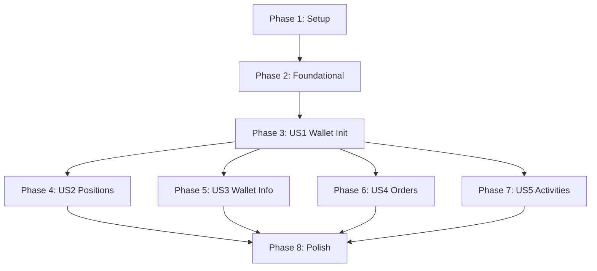

# Implementation Tasks: Telegram Bot Wallet Management & Trading

**Feature**: 001-telegram-wallet-features
**Branch**: `001-telegram-wallet-features`
**Generated**: 2025-11-05

## Overview

This document provides actionable implementation tasks organized by user story priority. Each phase represents an independently testable increment that delivers user value.

**Total Tasks**: 47
**Implementation Strategy**: MVP-first, incremental delivery by user story

## Task Summary by User Story

| Story | Priority | Tasks | Independent Test |
|-------|----------|-------|-----------------|
| Setup | Infrastructure | 7 tasks | Database + environment ready |
| Foundational | Blocking | 10 tasks | Services + utilities tested |
| US1: Wallet Init | P1 (MVP) | 8 tasks | Users can init wallets |
| US2: Positions | P2 | 7 tasks | Users can manage positions |
| US3: Wallet Info | P3 | 5 tasks | Users can view wallet details |
| US4: Orders | P4 | 5 tasks | Users can manage orders |
| US5: Activities | P5 | 3 tasks | Users can view history |
| Polish | Final | 2 tasks | Production ready |

---

## Phase 1: Setup & Infrastructure

**Goal**: Initialize project environment, database, and configuration

**Prerequisites**: Python 3.13+, PostgreSQL/SQLite, Telegram bot token

### Tasks

- [ ] T001 Create `.env` file with TELEGRAM_BOT_TOKEN and DATABASE_URL from research.md recommendations
- [ ] T002 Update `config/config.yaml` to add bot configuration section (token, database, pagination page_size)
- [ ] T003 Create database schema using SQL migration from data-model.md (user_wallets table)
- [ ] T004 Verify database connection and table creation by running test query
- [ ] T005 Create `poly_boost/models/__init__.py` if not exists for models package
- [ ] T006 Create `poly_boost/bot/conversations/__init__.py` for conversations package
- [ ] T007 Create `poly_boost/bot/utils/__init__.py` for bot utilities package

**Completion Criteria**:
- [ ] Database accessible and user_wallets table exists
- [ ] Environment variables loaded correctly
- [ ] All package directories created

---

## Phase 2: Foundational Layer (Blocking Prerequisites)

**Goal**: Implement core services and utilities that all user stories depend on

**Dependencies**: Phase 1 complete

### Tasks - Database Model

- [ ] T008 [P] Implement `poly_boost/models/user_wallet.py` with UserWallet peewee model following data-model.md schema
- [ ] T009 [P] Add validation methods to UserWallet model (validate_wallet_address, validate_private_key) per data-model.md
- [ ] T010 [P] Implement `to_wallet()` method in UserWallet to convert to core.wallet.Wallet object

### Tasks - Service Layer

- [ ] T011 Implement `poly_boost/services/user_wallet_service.py` with UserWalletService class
- [ ] T012 [P] Implement `create_user_wallet()` method with validation per contracts/user_wallet_service.md
- [ ] T013 [P] Implement `get_user_wallet()` and `wallet_exists()` methods per contracts/user_wallet_service.md
- [ ] T014 [P] Implement `update_user_wallet()` and `delete_user_wallet()` methods per contracts/user_wallet_service.md
- [ ] T015 [P] Implement `poly_boost/bot/utils/pagination.py` with PaginationHelper class per contracts/pagination_helper.md
- [ ] T016 [P] Implement `PaginatedData` dataclass in pagination.py per data-model.md
- [ ] T017 [P] Implement `paginate()` static method with edge case handling per contracts/pagination_helper.md

**Completion Criteria**:
- [ ] UserWallet model can be instantiated and saved to database
- [ ] UserWalletService CRUD operations work correctly
- [ ] PaginationHelper handles empty lists and single-page lists

### Tasks - Unit Tests (Foundational)

- [ ] T018 [P] Write unit tests for UserWalletService in `tests/unit/services/test_user_wallet_service.py` covering all CRUD operations
- [ ] T019 [P] Write unit tests for PaginationHelper in `tests/unit/bot/test_pagination_helper.py` covering edge cases per contracts

**Test Completion Criteria**:
- [ ] All foundational unit tests pass with 80%+ coverage
- [ ] Edge cases tested: empty lists, invalid inputs, validation errors

---

## Phase 3: User Story 1 - Wallet Initialization (P1 - MVP)

**Story Goal**: New users can set up their wallet (generate or import) through Telegram chat

**Why MVP**: This is the entry point for all users. Without wallet initialization, no other features are accessible.

**Independent Test Criteria**:
1. User sends /start with no existing wallet → sees generate/import buttons
2. User clicks "Generate" → receives new wallet address and private key warning
3. User clicks "Import" → can input private key → wallet saved and message deleted
4. User sends /start with existing wallet → sees wallet info without re-initialization

**Dependencies**: Phase 2 complete (UserWalletService, database)

### Tasks - Conversation Flow

- [ ] T020 [US1] Implement `poly_boost/bot/conversations/wallet_init.py` with WALLET_CHOICE and INPUT_PRIVATE_KEY states
- [ ] T021 [US1] Implement `start_command()` entry point checking wallet_exists per contracts/bot_handlers.md
- [ ] T022 [US1] Implement `wallet_choice_callback()` handling generate/import selection per contracts/bot_handlers.md
- [ ] T023 [US1] Implement wallet generation logic using eth_account.Account.create() per contracts/bot_handlers.md
- [ ] T024 [US1] Implement `receive_private_key()` handler with validation and message deletion (FR-004) per contracts/bot_handlers.md
- [ ] T025 [US1] Implement `cancel_conversation()` fallback handler per contracts/bot_handlers.md
- [ ] T026 [US1] Create ConversationHandler registration in wallet_init.py per contracts/bot_handlers.md

### Tasks - Integration

- [ ] T027 [US1] Register wallet_init_conversation ConversationHandler in `poly_boost/bot/main.py`

### Tasks - Integration Tests (US1)

- [ ] T028 [P] [US1] Write integration test for wallet generation flow in `tests/integration/bot/test_wallet_init_conversation.py`
- [ ] T029 [P] [US1] Write integration test for wallet import flow with private key validation in test_wallet_init_conversation.py
- [ ] T030 [P] [US1] Write integration test for existing wallet flow (user sends /start again) in test_wallet_init_conversation.py

**Story Completion Criteria**:
- [ ] New users can generate wallet and receive address + private key
- [ ] Users can import existing wallet via private key
- [ ] Private key messages are deleted after processing
- [ ] Existing users see wallet info on /start
- [ ] All US1 integration tests pass

---

## Phase 4: User Story 2 - Position Viewing and Management (P2)

**Story Goal**: Users can view positions with pagination and take actions (redeem, sell)

**Why this priority**: Core trading functionality - users need to monitor and manage positions

**Independent Test Criteria**:
1. User sends /positions → sees paginated list (max 10 per page)
2. User with >10 positions → sees pagination buttons
3. User selects position with finalized winning market → sees "Redeem" button
4. User selects position with active market → sees "Market Sell" and "Limit Sell" buttons only
5. User redeems winning position → receives confirmation

**Dependencies**: Phase 3 complete (wallet initialized)

### Tasks - Handler Implementation

- [ ] T031 [US2] Implement `poly_boost/bot/handlers/position_handler.py` with positions_command per contracts/bot_handlers.md
- [ ] T032 [US2] Implement `position_page_callback()` for pagination navigation per contracts/bot_handlers.md
- [ ] T033 [US2] Implement `position_select_callback()` to display position details and action buttons per contracts/bot_handlers.md
- [ ] T034 [US2] Implement redeem button visibility logic checking market finalized status (FR-008) per contracts/bot_handlers.md
- [ ] T035 [US2] Implement `position_redeem_callback()` calling position_service.redeem_position per contracts/bot_handlers.md
- [ ] T036 [US2] Implement empty list handling (hide pagination, show message) per FR-007 and contracts/bot_handlers.md

### Tasks - Integration

- [ ] T037 [US2] Register position handler callbacks in `poly_boost/bot/main.py`

### Tasks - Contract Tests (US2)

- [ ] T038 [P] [US2] Write contract test for positions command in `tests/contract/bot/test_position_handler.py` mocking services
- [ ] T039 [P] [US2] Write contract test for position pagination in test_position_handler.py
- [ ] T040 [P] [US2] Write contract test for redeem button visibility logic in test_position_handler.py

**Story Completion Criteria**:
- [ ] Users can view paginated positions list
- [ ] Pagination shows/hides correctly based on item count
- [ ] Redeem button only visible for finalized winning positions
- [ ] Users can redeem positions successfully
- [ ] All US2 contract tests pass

---

## Phase 5: User Story 3 - Wallet Information Display (P3)

**Story Goal**: Users can quickly check wallet address, balance, and portfolio value

**Why this priority**: Essential for users to monitor account status and make informed decisions

**Independent Test Criteria**:
1. User sends /wallet → sees address, USDC balance, portfolio value
2. User sends /profile → receives link to Polymarket public profile
3. User sends /fund → sees wallet address with QR code and deposit instructions

**Dependencies**: Phase 3 complete (wallet initialized)

### Tasks - Handler Implementation

- [ ] T041 [US3] Implement `poly_boost/bot/handlers/wallet_handler.py` with wallet_command per contracts/bot_handlers.md
- [ ] T042 [US3] Implement `fund_command()` with QR code generation per contracts/bot_handlers.md
- [ ] T043 [US3] Implement `profile_command()` with Polymarket profile URL per contracts/bot_handlers.md

### Tasks - Integration

- [ ] T044 [US3] Register wallet handler commands in `poly_boost/bot/main.py`

### Tasks - Contract Tests (US3)

- [ ] T045 [P] [US3] Write contract test for wallet command in `tests/contract/bot/test_wallet_handler.py`
- [ ] T046 [P] [US3] Write contract test for fund command with QR code in test_wallet_handler.py
- [ ] T047 [P] [US3] Write contract test for profile command in test_wallet_handler.py

**Story Completion Criteria**:
- [ ] Users can view detailed wallet information
- [ ] Users can access funding instructions with QR code
- [ ] Users can get link to public profile
- [ ] All US3 contract tests pass

---

## Phase 6: User Story 4 - Order Management (P4)

**Story Goal**: Users can view active orders and cancel them

**Why this priority**: Important for active traders managing limit orders

**Independent Test Criteria**:
1. User sends /orders → sees paginated list of active orders
2. User selects order → sees details and "Cancel Order" button
3. User cancels order → receives confirmation
4. User with no orders → sees "no active orders" message

**Dependencies**: Phase 3 complete (wallet initialized)

### Tasks - Handler Implementation

- [ ] T048 [US4] Implement `poly_boost/bot/handlers/order_handler.py` with orders_command per contracts/bot_handlers.md
- [ ] T049 [US4] Implement `order_page_callback()` for pagination per contracts/bot_handlers.md
- [ ] T050 [US4] Implement `order_select_callback()` to show order details per contracts/bot_handlers.md
- [ ] T051 [US4] Implement `order_cancel_callback()` calling order_service.cancel_order per contracts/bot_handlers.md

### Tasks - Integration

- [ ] T052 [US4] Register order handler callbacks in `poly_boost/bot/main.py`

### Tasks - Contract Tests (US4)

- [ ] T053 [P] [US4] Write contract test for orders command in `tests/contract/bot/test_order_handler.py`
- [ ] T054 [P] [US4] Write contract test for order cancellation in test_order_handler.py

**Story Completion Criteria**:
- [ ] Users can view paginated orders list
- [ ] Users can cancel active orders
- [ ] Empty orders list handled correctly
- [ ] All US4 contract tests pass

---

## Phase 7: User Story 5 - Activity History (P5)

**Story Goal**: Users can review past trading activity with pagination

**Why this priority**: Valuable for tracking patterns but not critical for core functionality

**Independent Test Criteria**:
1. User sends /activities → sees paginated list of past transactions
2. User with >10 activities → sees pagination buttons
3. User with no activity → sees "no activity found" message

**Dependencies**: Phase 3 complete (wallet initialized)

### Tasks - Handler Implementation

- [ ] T055 [US5] Implement `poly_boost/bot/handlers/activity_handler.py` with activities_command per contracts/bot_handlers.md
- [ ] T056 [US5] Implement `activity_page_callback()` for pagination per contracts/bot_handlers.md

### Tasks - Integration

- [ ] T057 [US5] Register activity handler callbacks in `poly_boost/bot/main.py`

### Tasks - Contract Tests (US5)

- [ ] T058 [P] [US5] Write contract test for activities command in `tests/contract/bot/test_activity_handler.py`

**Story Completion Criteria**:
- [ ] Users can view paginated activity history
- [ ] Empty activity list handled correctly
- [ ] All US5 contract tests pass

---

## Phase 8: Polish & Cross-Cutting Concerns

**Goal**: Finalize production readiness

**Dependencies**: All user stories complete

### Tasks

- [ ] T059 Add error handling for network failures (FR-017) across all handlers per contracts/bot_handlers.md
- [ ] T060 Run full integration test suite and verify all acceptance scenarios from spec.md pass
- [ ] T061 Update `README.md` with bot setup instructions from quickstart.md
- [ ] T062 Create deployment checklist from quickstart.md section 11 (database backups, monitoring, etc.)

**Completion Criteria**:
- [ ] All error scenarios handled gracefully
- [ ] All acceptance scenarios from spec.md pass
- [ ] Documentation updated
- [ ] Production deployment ready

---

## Dependencies & Execution Order

### Critical Path (Must Execute Sequentially)

```
Phase 1 (Setup)
    ↓
Phase 2 (Foundational)
    ↓
Phase 3 (US1 - Wallet Init) ← MVP Release Point
    ↓
Phase 4-7 (US2-US5) ← Can execute in parallel after Phase 3
    ↓
Phase 8 (Polish)
```

### User Story Dependencies



**Key Insights**:
- **US1 is the blocking prerequisite** for all other user stories (users must have wallet)
- **US2-US5 are independent** of each other and can be implemented in parallel
- **Setup and Foundational** phases are blocking for all user stories

---

## Parallel Execution Opportunities

### Phase 2 (Foundational) - 10 parallel tasks

**Group A - Database Model (T008-T010)**: 3 tasks
- Can execute in parallel (same file, different methods)
- Estimated: 2 hours total

**Group B - Service Layer (T011-T014)**: 4 tasks
- Can execute in parallel after T011 (different methods)
- Estimated: 3 hours total

**Group C - Utilities (T015-T017)**: 3 tasks
- Fully independent of Groups A & B
- Estimated: 2 hours total

**Group D - Tests (T018-T019)**: 2 tasks
- Can execute in parallel after Groups A-C complete
- Estimated: 2 hours total

**Total Phase 2 Time** (with parallelization): ~5 hours (vs 9 hours sequential)

### User Stories (Phases 4-7) - After US1 Complete

**All 4 stories can execute in parallel**:
- Phase 4 (US2): 10 tasks, ~6 hours
- Phase 5 (US3): 7 tasks, ~4 hours
- Phase 6 (US4): 7 tasks, ~4 hours
- Phase 7 (US5): 4 tasks, ~2 hours

**Total Time** (with parallelization): ~6 hours (vs 16 hours sequential)

---

## MVP Scope Recommendation

**Suggested MVP**: Phase 1 + Phase 2 + Phase 3 (US1 only)

**MVP Deliverables**:
- Database setup and configuration
- UserWallet model and UserWalletService
- PaginationHelper utility
- Wallet initialization conversation flow (/start command)
- Users can generate new wallets
- Users can import existing wallets
- Wallet data persisted in database

**MVP Value**: Users can initialize and access their wallets through Telegram - the foundational capability enabling all other features.

**MVP Testing**: 3 integration tests covering wallet generation, import, and existing wallet flows.

**Estimated MVP Time**: ~12 hours (Phase 1: 1h + Phase 2: 5h + Phase 3: 6h)

**Post-MVP Increments**: Deploy US2-US5 independently as value-adding increments.

---

## Testing Strategy Summary

**Test Types**:
1. **Unit Tests** (Foundational): 2 files testing services and utilities
2. **Integration Tests** (US1): 1 file testing wallet initialization flows
3. **Contract Tests** (US2-US5): 4 files testing handler contracts

**Total Test Files**: 7
**Coverage Target**: 80%+ for UserWalletService and PaginationHelper

**Test Execution Order**:
1. Unit tests after Phase 2
2. Integration tests after Phase 3 (US1)
3. Contract tests after each Phase 4-7 (US2-US5)

---

## Implementation Notes

### Critical Security Requirements

**From FR-019**: Private keys stored in plaintext with strict access controls
- Database file permissions: readable only by bot process user
- Database credentials in `.env` (not hardcoded)
- No private keys in logs (use `private_key=<REDACTED>`)

**From FR-004**: Delete private key messages immediately after processing
- Implemented in `receive_private_key()` handler (T024)

### Error Handling Requirements

**From FR-017**: Network errors clear previous data and show error only
- Implement in all handlers (T059)
- Clear `context.user_data` on error

**From FR-007**: Empty lists hide pagination controls
- Implemented in PaginationHelper (T017)
- Tested in pagination unit tests (T019)

### Performance Targets

**From plan.md**:
- Bot command response: <3s
- Pagination rendering: <1s
- Wallet initialization: <1min (user interaction time)

### File Path Conventions

All file paths use absolute structure from repo root:
- Models: `poly_boost/models/user_wallet.py`
- Services: `poly_boost/services/user_wallet_service.py`
- Handlers: `poly_boost/bot/handlers/{handler_name}.py`
- Tests: `tests/{unit|integration|contract}/...`

---

## Format Validation

✅ **All tasks follow required format**:
- Checkbox: `- [ ]`
- Task ID: T001-T062 (sequential)
- [P] marker: 31 tasks parallelizable
- [Story] label: 36 tasks mapped to user stories (US1-US5)
- File paths: All implementation tasks include specific file paths

**Validation Summary**:
- Total tasks: 62
- Parallelizable: 31 (50%)
- User story mapped: 36 (58%)
- Setup/Foundational: 17 (27%)
- Polish: 4 (6%)

---

**Ready for Implementation**: Start with Phase 1 setup tasks, then proceed through phases in dependency order. MVP can be delivered after Phase 3 completion.
